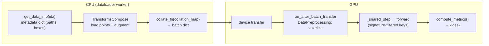

# Data Flow — one sample's journey from disk to a loss value

> [execution_flow.md](execution_flow.md) traced the *control* flow. This traces the *data*:
> how a single training sample becomes a batch, reaches the GPU, produces predictions, and
> turns into a loss. We use **CenterPoint on a LiDAR dataset** as the running example
> because it exercises every stage cleanly.
>
> Deep dives: [../dataset/dataset_pipeline.md](../dataset/dataset_pipeline.md) and
> [../dataset/augmentation.md](../dataset/augmentation.md).

---

## The seven hops

```text
(1) info record        get_data_info(index)              dict of metadata (paths, boxes, calib)
        │
(2) transforms         TransformsCompose (CPU, worker)   load points, augment  → sample dict
        │
(3) collation          collate_fn + collation_map        batch dict of lists/tensors
        │
(4) device transfer    Lightning moves batch to GPU
        │
(5) preprocessing      on_after_batch_transfer           DataPreprocessing: voxelize (GPU)
        │
(6) forward            BaseModel._shared_step → forward   predictions
        │
(7) loss / metrics     compute_metrics()                 {"loss": ...}  (+ eval accumulation)
```

Two design rules govern this whole path and explain most "surprises":

1. **`get_data_info` returns metadata, not tensors.** File loading happens in
   **transforms**, not in the dataset. The dataset only says "this sample exists and here
   is where to find it."
2. **`collation_map` is a strict whitelist.** Only keys listed in `collation_map` survive
   into the batch. Any key a transform produced but that isn't listed is **silently
   dropped** before the model ever sees it. This is the #1 source of "why is my key
   missing in `forward`?" confusion.

---

## Hop 1 — the info record (`Dataset.get_data_info`)

`autoware_ml/datamodule/base.py` defines the abstract `Dataset`. `__getitem__` does:

```python
def __getitem__(self, index):
    input_dict = self.get_data_info(index)                       # abstract, per dataset
    context = PipelineContext(dataset=self, index=index)         # orchestration state
    return self.apply_transforms(input_dict, self.dataset_transforms, context)
```

For LiDAR detection (`datamodule/t4dataset/detection3d.py`), `get_data_info(index)` returns
a plain dict like:

```python
{
  "instances":   [...],           # raw annotation records
  "class_names": [...],
  "name_mapping": {...},
  "lidar_path":  "/abs/path/....pcd.bin",   # a PATH, not points
  "sweeps":      [...],           # historical frames for multi-sweep
  "num_pts_feats": 5,
  "sample_token": "...", "timestamp": ...,
}
```

Note: **no point cloud yet** — just a path. The annotations file itself (the `.pkl`) was
loaded once in the dataset's `__init__`.

> `PipelineContext` (`datamodule/pipeline_context.py`) carries `dataset`, `index`, and an
> RNG. It lets a transform fetch a *second* sample (`sample_secondary`) for mixing
> augmentations (e.g. copy-paste) without stuffing that machinery into the sample dict.

---

## Hop 2 — transforms (CPU, in a dataloader worker)

`apply_transforms` runs a `TransformsCompose` — an ordered list of `BaseTransform`s, each
**dict-in / dict-out**: it reads some keys, returns updates, and the composer merges them
(`input_dict |= transform(input_dict)`). For CenterPoint's train pipeline the order is
roughly:

| # | Transform | Reads → Writes |
| - | --------- | -------------- |
| 1 | `MergeObjects3D` | `instances` → merged `instances` |
| 2 | `LoadAnnotations3D` | `instances` → `gt_boxes (N,9)`, `gt_names`, `gt_labels`, `gt_num_points` |
| 3 | `LoadPointsFromMultiSweeps` | `lidar_path`,`sweeps` → `points` (with a per-point time-lag column) |
| 4 | `GlobalRotScaleTrans` | jointly rotates/scales/translates `points` **and** `gt_boxes` |
| 5 | `RandomFlip3D` | jointly flips `points` and `gt_boxes` |
| 6 | `PointsRangeFilter` | crop `points` to `point_cloud_range` |
| 7 | `ObjectRangeFilter` / `ObjectRangeMinPointsFilter` | drop out-of-range / too-sparse boxes |
| 8 | `PointShuffle` | shuffle `points` order |

After this hop the sample dict holds real tensors: `points`, `gt_boxes`, `gt_labels`
(plus other keys that will be dropped next).

The augmentation library and the `BaseTransform` contract are covered in
[../dataset/augmentation.md](../dataset/augmentation.md).

---

## Hop 3 — collation (`collate_fn` + `collation_map`)

The `DataLoader` calls `DataModule.collate_fn` (`datamodule/base.py`) to merge the list of
per-sample dicts into one batch dict. It consults `collation_map`, a per-key strategy
table from the config:

```yaml
# CenterPoint uses list-mode for everything (variable sizes; voxelization is deferred)
datamodule:
  collation_map:
    points:    list
    gt_boxes:  list
    gt_labels: list
```

Strategies (`datamodule/collation.py`):

| Strategy | Meaning | Typical use |
| -------- | ------- | ----------- |
| `stack` | `torch.stack` — all shapes must match | fixed-shape tensors (images) |
| `concat` | cat along dim 0 + add a `batch["offset"]` of cumulative lengths | variable-length point clouds (PTv3) |
| `index_concat` | like `concat` but shifts integer indices to stay valid after concat | point indices |
| `list` | keep as a Python list, no tensor merge | per-sample variable data (CenterPoint points/boxes) |

**Critical rule:** keys **not** in `collation_map` are dropped. Keys that *are* listed but
missing from a sample produce a warning and are skipped. So `sample_token`, `gt_names`,
`timestamp` etc. never reach the model unless you explicitly add them to `collation_map`.

Keys that only train transforms produce (e.g. StreamPETR's projected 2D auxiliary
annotations) go in `datamodule.train_collation_map` instead: it is merged on top of
`collation_map` for the train dataloader only, so val/test/predict collation neither
expects nor warns about them.

After this hop: `batch = {"points": [t0..tB], "gt_boxes": [...], "gt_labels": [...]}`.

---

## Hop 4 — device transfer

Lightning moves the batch to the GPU. Nothing you wrote runs here; it's the boundary
between the CPU pipeline (worker processes, numpy) and the GPU pipeline (torch on device).

---

## Hop 5 — runtime preprocessing (GPU, model-owned)

`BaseModel.on_after_batch_transfer` (a Lightning hook, `models/base.py`) runs the
model-owned `DataPreprocessing` pipeline **on the GPU, per batch**:

```python
def on_after_batch_transfer(self, batch, dataloader_idx):
    return self._data_preprocessing(batch)   # installed via set_data_preprocessing(cfg.data_preprocessing)
```

For CenterPoint this runs `PointPillarPreprocessor`
(`preprocessing/detection3d/point_pillar.py`), which voxelizes each sample's `points` and
**adds** three keys to the batch: `voxels`, `num_points`, `voxel_coords` (the last carries a
prepended batch index).

> **Why here and not in a transform?** Voxelization is heavy and GPU-friendly, and it is a
> *model* concern (the voxel grid must match the model's expectations). The framework keeps
> per-sample CPU augmentation (transforms) separate from per-batch GPU shaping
> (preprocessing). See [../dataset/dataset_pipeline.md](../dataset/dataset_pipeline.md).

---

## Hop 6 — forward (the signature-inspection trick)

`BaseModel._shared_step` does something subtle and important. It does **not** pass the whole
batch to `forward`. It inspects `forward`'s signature (captured once at construction as
`self.forward_signature`) and passes only the keys whose names match parameters:

```python
forward_inputs = {k: batch[k] for k in self.forward_signature.parameters if k in batch}
outputs = self(**forward_inputs)
```

CenterPoint declares `forward(self, voxels, num_points, voxel_coords)`, so **only those
three keys** flow into `forward`. `gt_boxes` / `gt_labels` are *ignored by forward* but
remain in the batch for the loss step.

```text
voxels,num_points,voxel_coords
   → PillarFeatureNet (voxel encoder)
   → PointPillarsScatter (middle encoder → dense BEV)
   → SECONDBackbone
   → SECONDFPN (neck)
   → CenterHead → dict{heatmap, reg, height, dim, rot[, vel]}
```

This is why the "Adding Models" guide stresses: **`forward()` parameter names must match
batch keys.** The mechanism is covered in [../model/model_architecture.md](../model/model_architecture.md).

---

## Hop 7 — loss and evaluation

`compute_metrics(batch, outputs)` receives the **full** batch (so it still has `gt_boxes` /
`gt_labels`) and the forward outputs. CenterPoint delegates to its head:

```python
def compute_metrics(self, batch, outputs):
    return self.bbox_head.loss(outputs, batch["gt_boxes"], batch["gt_labels"])
    # → {"loss": total, "loss_heatmap": ..., "loss_bbox": ...}
```

`_shared_step` asserts a `"loss"` key exists, logs every entry under `train/…` or `val/…`,
and `training_step` returns `metrics["loss"]` for Lightning to back-propagate.

During **validation/test** an extra path runs (not during training): `validation_step`
stashes the raw outputs, and `MetricEvalMixin` calls the model's `build_eval_output(...)`
to produce the flat dict that the `MetricSuite`s accumulate into mAP/NDS. See
[../evaluation/evaluation_pipeline.md](../evaluation/evaluation_pipeline.md).

---

## The whole journey on one page



---

## Common debugging cases

| Symptom | Cause | Fix |
| ------- | ----- | --- |
| `KeyError: 'foo'` inside `forward`/`compute_metrics` | `foo` not in `collation_map`, so it was dropped at collation | Add `foo` to `datamodule.collation_map` with the right strategy |
| Shapes mismatch in `collate_fn` (`stack` fails) | Variable-size tensors collated with `stack` | Use `list` or `concat` for that key |
| `offset` key errors | Used `index_concat` without any `concat` key | The first `concat` key defines the space `index_concat` shifts into |
| Points look wrong / boxes misaligned | A geometry transform applied to points but not boxes (or vice versa) | Geometry transforms must transform `points` **and** `gt_boxes` jointly; check the transform |
| Voxel keys (`voxels`, …) missing in `forward` | `data_preprocessing` not attached, or pipeline empty | `cfg.data_preprocessing.pipeline`; `set_data_preprocessing` is called in `scripts/train.py` |
| Augmentation applied at test time | Wrong split's transform pipeline | `val_transforms`/`test_transforms` should exclude random augmentations |

---

## Common modification scenarios

| I want to… | Do this |
| ---------- | ------- |
| Feed a new tensor to the model | Produce it in a transform (or preprocessing) **and** add it to `collation_map` **and** add a matching `forward` parameter |
| Add a new augmentation | Write a `BaseTransform`, add it to `train_transforms.pipeline` — see [../dataset/augmentation.md](../dataset/augmentation.md) |
| Change voxelization | Edit/replace the `DataPreprocessing` layer in `cfg.data_preprocessing.pipeline` |
| Keep metadata for debugging | Add the key (e.g. `sample_token`) to `collation_map` with strategy `list` |

---

**Next:** you now understand the framework's shape, its runtime flow, and its data flow.
Continue with the code-level walkthroughs in
[../code_walkthrough/](../code_walkthrough/entry_point.md), or jump to the area you need:
[../dataset/](../dataset/dataset_pipeline.md) · [../model/](../model/model_architecture.md) · [../training/](../training/training_loop.md) ·
[../evaluation/](../evaluation/evaluation_pipeline.md) · [../deployment/](../deployment/export_pipeline.md).
