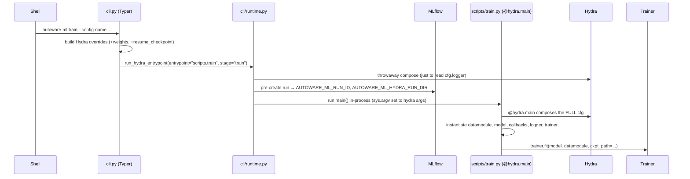

# Execution Flow — what happens when you run `autoware-ml train`

> This document traces the **control flow** of a training run: from the command you type to
> `trainer.fit()`. Read it once and the whole framework stops feeling like magic.
>
> Companion documents: [data_flow.md](data_flow.md) traces the *data*;
> [../code_walkthrough/entry_point.md](../code_walkthrough/entry_point.md) is the same story
> at maximum zoom (every function, every `file:line`).

---

## Why there is a "CLI layer" and a separate "script layer"

A naive design would make `autoware-ml train` directly run Hydra. Autoware-ml splits it in
two on purpose:

- **`autoware_ml/cli/`** — a **Typer** CLI. It must start *fast* (for shell tab-completion)
  and must not import torch/Hydra/MLflow at import time. It only parses arguments and then
  *lazily* dispatches.
- **`autoware_ml/scripts/`** — the **real `@hydra.main` entrypoints** (`train.py`,
  `test.py`, `deploy.py`). These do the heavy work.

The bridge between them, `autoware_ml/cli/runtime.py`, also does one clever thing before the
real job starts: it **pre-creates the MLflow run** so the run directory is known up front
and the Hydra output dir and the MLflow artifact dir line up.

---

## The call chain (high level)



---

## Step by step

### 1. The console script

`pyproject.toml` declares the entry point:

```toml
[project.scripts]
autoware-ml = "autoware_ml.cli.cli:main"
```

So `autoware-ml ...` calls `autoware_ml/cli/cli.py:main()`, which just runs the Typer app
(`app()`). Typer routes the first argument (`train`, `test`, `deploy`, `mlflow`,
`session`, `create-dataset`) to the matching command function.

> **Real command names:** `train`, `test`, `deploy`, `create-dataset`, `mlflow ui`,
> `mlflow export`, `session start|attach|detach|ls|stop`. There is **no `predict`**
> subcommand, and dataset generation is `create-dataset` (not `create-data`).

### 2. The `train` subcommand

`cli.py`'s `train()` command:

- validates that `--weights` and `--resume-checkpoint` are **mutually exclusive**,
- turns them into Hydra overrides: `+weights=[...]` or `+resume_checkpoint=...`,
- forwards all remaining args to Hydra (so `trainer.max_epochs=100` "just works"),
- calls the lazy dispatcher `run_lazy_script(...)` → `run_hydra_entrypoint` in
  `cli/runtime.py`, passing `entrypoint_module="autoware_ml.scripts.train"` and
  `stage="train"`.

`run_lazy_script` (`utils/cli/helpers.py`) is a one-liner:
`importlib.import_module(module_path)` then `getattr(module, fn)(...)`. This is what keeps
torch/Hydra out of CLI startup.

### 3. `run_hydra_entrypoint` — the bridge (`cli/runtime.py`)

Two responsibilities:

1. **Pre-create the run environment** (`prepare_runtime_environment`): it does a *first,
   throwaway* Hydra compose just to read `cfg.logger`. If a logger is configured, it
   creates the MLflow run now and exports `AUTOWARE_ML_RUN_ID` and
   `AUTOWARE_ML_HYDRA_RUN_DIR`. This is why the Hydra job dir and the MLflow artifact dir
   match — the run dir is pinned via `configs/defaults/modules/run.yaml`, which reads
   `${oc.env:AUTOWARE_ML_HYDRA_RUN_DIR,...}`.
2. **Run the real entrypoint**: it sets `sys.argv` to the Hydra invocation
   (`--config-name <name>` + overrides) and calls
   `run_lazy_script("autoware_ml.scripts.train", "main")`.

### 4. `scripts/train.py:main` — the real Hydra entrypoint

```python
@hydra.main(version_base=None, config_path=_CONFIG_PATH)   # _CONFIG_PATH = autoware_ml/configs
def main(cfg: DictConfig):
    ...
```

**This decorator is where Hydra composes the full config for the job.** From here on, `cfg`
is a fully resolved `DictConfig`. `main` then, in order (approx. `train.py:86–156`):

```python
configure_torch_runtime(); set_seed(cfg)                          # TF32, seed_everything

datamodule = hydra.utils.instantiate(cfg.datamodule)              # :90  → a DataModule
model      = hydra.utils.instantiate(cfg.model)                   # :93  → a BaseModel
model.set_data_preprocessing(hydra.utils.instantiate(cfg.data_preprocessing))  # :94

# --weights → apply_matching_weights(model, ...);  --resume → validate ckpt   :96–114

callbacks     = instantiate_callbacks(cfg, ...)                   # ModelCheckpoint, EarlyStopping, LRMonitor
trainer_logger = hydra.utils.instantiate(cfg.logger)              # MLFlowLogger (if enabled)
trainer        = instantiate_trainer(cfg, callbacks, trainer_logger, root_dir)  # lightning.Trainer

trainer.fit(model, datamodule=datamodule, ckpt_path=resume_checkpoint_path)     # :156

return float(trainer.callback_metrics[cfg.optimized_metric])      # for Optuna sweeps
```

**The one thing to memorize:** every major object — `datamodule`, `model`, `logger`,
`trainer`, and (via `instantiate_callbacks`/`instantiate_trainer`) callbacks and the trainer
— is produced by `hydra.utils.instantiate(cfg.<section>)`. The Python here is just glue;
the *definitions* live in YAML.

### 5. `trainer.fit()` — Lightning takes over

From `trainer.fit()` onward you are inside PyTorch Lightning. It calls, in a loop, the
hooks your model inherited from `BaseModel`:

```text
per batch:  on_after_batch_transfer  →  training_step  →  (backward, optimizer.step)
per epoch:  validation_step ×N  →  on_validation_epoch_end (metrics)  →  ModelCheckpoint
```

Those hooks are covered in [../training/training_loop.md](../training/training_loop.md) and
[../model/model_architecture.md](../model/model_architecture.md).

---

## `test` and `deploy` are the same shape

They reuse the *identical* bridge (`run_hydra_entrypoint`) and the same instantiation
pattern; only the last step differs:

| Command | Last step | Notes |
| ------- | --------- | ----- |
| `train` | `trainer.fit(...)` | May resume from a full checkpoint |
| `test`  | `trainer.test(...)` | Loads `--weights` via `apply_matching_weights(set_eval=True)`; runs on 1 device by default |
| `deploy`| exports ONNX/TensorRT per module | No `fit`/`test`; loads weights, grabs one predict batch, exports |

Because all three read the **same config**, "the thing you trained" and "the thing you
deploy" are guaranteed to be the same architecture.

---

## Where things run (CPU vs GPU vs subprocess)

- **CLI parsing + MLflow pre-creation** — CPU, main process, fast.
- **`@hydra.main` compose + instantiation** — CPU, main process.
- **DataModule workers (transforms)** — CPU, in `num_workers` subprocesses.
- **`on_after_batch_transfer` + `forward` + loss + backward** — GPU.
- **DDP (multi-GPU)** — Lightning spawns one process per GPU when `devices>1` and
  `strategy=auto` picks DDP; single-GPU stays in the main process (no subprocess overhead).

---

## Common debugging cases

| Symptom | Cause | Fix / where to look |
| ------- | ----- | ------------------- |
| Command hangs before training | The throwaway Hydra compose failed silently, or MLflow DB locked | Run with the same config and `--cfg job` to print the resolved config |
| "Config composition" / `MissingMandatoryValue` errors | A `???` field not filled, or a bad `defaults:` entry | The task `base.yaml` and the leaf config |
| Overrides ignored | Used `+key=` on an existing key, or `_self_` ordering | [../code_walkthrough/config_flow.md](../code_walkthrough/config_flow.md) |
| Run dir / MLflow dir mismatch | `AUTOWARE_ML_HYDRA_RUN_DIR` not honored | `configs/defaults/modules/run.yaml`, `cli/runtime.py` |
| Multi-GPU won't start | `strategy`/`devices` mismatch | `trainer.devices=[0,1]`, see `docs/user-guide/training.md` |
| Want to see the exact config used | — | `autoware-ml train --config-name ... --cfg job` (prints without running) |

---

## Common modification scenarios

| I want to… | Do this |
| ---------- | ------- |
| Add a new CLI flag to `train` | Edit the `train()` command in `cli/cli.py`, translate it to a Hydra override, then read it in `scripts/train.py` |
| Change what runs after `fit` | Edit `scripts/train.py` (e.g. auto-run `test`) |
| Add a new subcommand | Add a Typer command in `cli/cli.py` + a `scripts/<name>.py` entrypoint |
| Change the default run/artifact layout | `configs/defaults/modules/run.yaml` + `utils/mlflow_helpers.py` |

---

**Next:** [data_flow.md](data_flow.md) — now follow the *data* through this same machine.
