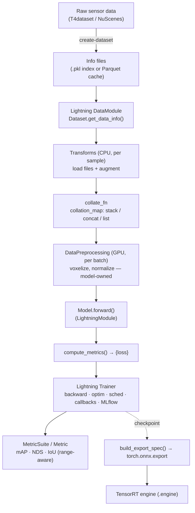

# Framework Overview

> **Read this first.** It gives you the world-view (why the framework exists and how it is
> shaped) and a map of the repository. Later documents zoom into each area.

---

## 1. What problem does Autoware-ML solve?

[Autoware](https://autoware.org/) is an open-source autonomous-driving stack. It needs
**perception models** — 3D object detectors, LiDAR semantic segmenters, camera-based
classifiers — that run **on the vehicle's NVIDIA GPU through TensorRT**, in real time.

Producing such a model is a long chain:

```text
raw sensor logs → annotated dataset → training → evaluation → ONNX → TensorRT engine
```

Without a framework, three things go wrong:

1. **Every model reinvents the chain.** Data loading, the training loop, checkpointing,
   metrics, and export get re-written per model, slightly differently each time.
2. **Training and deployment drift apart.** The exported model stops matching the trained
   one because export lives in a separate script that nobody updates.
3. **Experiments are not reproducible.** "Which config produced this checkpoint?" becomes
   unanswerable.

**Autoware-ML's answer:** a single framework where **every model — whatever its internal
architecture — flows through the same contract**, from dataset to TensorRT. You add a
model by implementing a small interface; the framework owns the loop, distributed
training, logging, checkpointing, evaluation, and export.

> Autoware-ML is the **ground-up successor to `tier4/AWML`** (the older, MMDetection3D-based
> repo, `README.md`). It targets the same goal — deploy perception models for Autoware —
> with a cleaner, more modern architecture.

---

## 2. Why *this* design? (and how it differs from what you know)

This is the most important section. If you skip it, every file will look arbitrary.

### The stack

Autoware-ML is built on four load-bearing libraries (`pyproject.toml`):

| Library | Role | What it replaces from "plain PyTorch" |
| ------- | ---- | -------------------------------------- |
| **PyTorch Lightning** (`lightning==2.6.1`) | The training loop, DDP, precision, checkpoints, hooks | The hand-written `for epoch in ...` loop |
| **Hydra** (`hydra-core==1.3.2`) | Config composition + object instantiation | argparse + manual `Model(...)` construction |
| **MLflow** (`mlflow==3.10.1`) | Experiment tracking (params, metrics, artifacts) | Print statements / TensorBoard glue |
| **Pydantic + jaxtyping** | Typed dataset schemas + typed tensor shapes | Untyped dicts and silent shape bugs |

Plus **Optuna** (hyperparameter search via `hydra-optuna-sweeper`), **pixi** (environment
management), and **zensical** (the docs site you may be reading this on).

### The two ideas you must absorb

**(a) There is no registry. `_target_` is a Python import path.**

In MMDetection3D / OpenMMLab / old AWML, you register a class with a decorator and refer to
it by a string `type`:

```python
@MODELS.register_module()          # OLD (MMDet3D / AWML)
class CenterHead(nn.Module): ...
# config:  dict(type='CenterHead', ...)
```

In Autoware-ML there is **no decorator and no registry**. The config names the class by its
**full dotted import path**, and Hydra imports and calls it:

```yaml
# NEW (Autoware-ML)
bbox_head:
  _target_: autoware_ml.models.detection3d.heads.centerpoint.CenterHead
  # ...constructor kwargs...
```

`hydra.utils.instantiate(cfg.bbox_head)` literally does
`from autoware_ml.models.detection3d.heads.centerpoint import CenterHead; CenterHead(**kwargs)`.

Consequences you will feel:

- **`__init__.py` files are intentionally kept empty** (no re-exports). `_target_` and
  imports point at the *implementation module* directly. Don't "helpfully" add re-exports.
- **To find a component, read the `_target_` string** — it is the file path. No grep for
  a registration decorator needed.
- **Most errors are import/instantiation errors.** A typo in `_target_` fails at build
  time with a clear "cannot import" message.

**(b) Models live *inside* the package, not in a separate `projects/` tree.**

Old AWML put each model under `projects/<Model>/`. Autoware-ML puts them in
`autoware_ml/models/`. There is **no `projects/` directory**. A "model" is just a subclass
of `BaseModel` plus a config; it does not get its own top-level folder.

### Side-by-side cheat sheet

| Concern | Plain PyTorch | MMDet3D / AWML (old) | **Autoware-ML** |
| ------- | ------------- | -------------------- | --------------- |
| Training loop | hand-written | MMEngine `Runner` | **Lightning `Trainer`** |
| Component wiring | manual construct | Registry + string `type=` | **Hydra `_target_` = import path** |
| Config format | argparse/dict | MMEngine `Config` (`.py`, `_base_`) | **Hydra YAML** (`defaults:`, `${...}`) |
| Model location | anywhere | `projects/<Model>/` | **`autoware_ml/models/`** |
| Base class | `nn.Module` | `BaseModel`/`Base3DDetector` (MM) | **`BaseModel(LightningModule)`** |
| Metrics | you write it | MM `Metric` + evaluator | **`MetricSuite` (torchmetrics)** |
| Tracking | manual | hooks | **MLflow (built in)** |
| Export | separate repo/script | `mmdeploy` | **`build_export_spec()` in the model** |

---

## 3. The end-to-end pipeline



| Stage | Responsibility | Where it lives |
| ----- | -------------- | -------------- |
| **create-dataset** | Turn raw annotations into fast, indexable info files | `autoware_ml/tools/dataset/`, `databases/` |
| **DataModule / Dataset** | Decide *which* samples exist; return raw metadata dicts | `autoware_ml/datamodule/` |
| **Transforms** | Actually *load* the point cloud/image and *augment* it (CPU, per sample) | `autoware_ml/transforms/` |
| **collate_fn** | Merge samples into a batch via a per-key strategy | `autoware_ml/datamodule/base.py` |
| **DataPreprocessing** | GPU, per-batch step the *model owns* (e.g. voxelization) | `autoware_ml/preprocessing/` |
| **Model** | `forward()` + `compute_metrics()`; rest inherited from `BaseModel` | `autoware_ml/models/` |
| **Trainer** | The loop you never write: backward, optim, DDP, precision, checkpoints | Lightning + `autoware_ml/callbacks/` |
| **Metrics** | Accumulate over an epoch, reduce across GPUs, report per distance range | `autoware_ml/metrics/` |
| **Export** | Model declares *what* to export; framework does ONNX → TensorRT | `autoware_ml/utils/deploy.py`, `ops/` |

Colour intuition (from `docs/framework/design.md`): the CPU side is everything up to and
including `collate_fn`; the GPU side starts at `DataPreprocessing` and continues through
`forward`, loss, and backward.

---

## 4. The engineer's workflow

```bash
# 0. Enter the environment (Docker image, or local pixi)
./docker/container.sh --run                 # or: pixi shell --environment default

# 1. Build info files from a dataset
autoware-ml create-dataset --dataset nuscenes --task detection3d \
    --root-path data/nuscenes --out-dir data/nuscenes/info --version v1.0-trainval

# 2. Train. --config-name is the path under configs/tasks/ minus the .yaml
autoware-ml train --config-name detection3d/centerpoint/voxel020_second_secfpn_51m_nuscenes

# 3. Watch it (params / metrics / artifacts)
autoware-ml mlflow ui --port 5000

# 4. Evaluate a checkpoint (same config!)
autoware-ml test --config-name <same> \
    --weights mlruns/<task>/<model>/<config>/<run_id>/artifacts/checkpoints/best.ckpt

# 5. Export to ONNX (+ TensorRT)
autoware-ml deploy --config-name <same> \
    --weights mlruns/<task>/<model>/<config>/<run_id>/artifacts/checkpoints/best.ckpt
```

Two ideas make this coherent:

- **One `--config-name` = one `(task, model, variant, dataset)` tuple.** The *same* config
  drives train, test, and deploy — the trained artifact and the exported artifact cannot
  drift apart because they read the same description.
- **Anything is a Hydra override away.** `trainer.max_epochs=100`,
  `model.optimizer.lr=1e-4`, `trainer.precision=16-mixed`, `--multirun` for sweeps. You
  rarely edit YAML to run an experiment.

---

## 5. Repository map

Two levels matter: the **repo root** (project infrastructure) and the **`autoware_ml/`
package** (the framework itself).

### 5.1 Repo root

| Path | Purpose | If you change it… |
| ---- | ------- | ----------------- |
| `autoware_ml/` | **The framework package.** Everything importable. | See 5.2 — this is where real work happens |
| `docs/` | The `zensical` documentation site (this guide lives in `docs/onboarding/`) | Affects docs only |
| `docker/` | `container.sh` + Dockerfile; the supported runtime | Affects how everyone runs the code |
| `ansible/` | Host/machine provisioning | Ops only |
| `pyproject.toml` | Dependencies, the `autoware-ml` console script, pixi environments, ruff | Changes the whole environment; needs re-install |
| `pixi.lock` | Pinned dependency lockfile | Reproducibility; regenerate carefully |
| `set_data_path.sh` | Sets `AUTOWARE_ML_DATA_PATH` (dataset root) | Where datasets are found |
| `mlruns/` | MLflow store (runs, checkpoints, artifacts) — generated | Your experiment history |
| `work_dirs/`, `data/` | Generated outputs / datasets — gitignored | Local only |

### 5.2 The `autoware_ml/` package

Grouped by role. The **direction of dependency** matters: configs and CLI sit on top;
models/datamodule/transforms are the middle; ops/geometry/utils are the foundation.

**Orchestration (top layer — how a run is driven)**

| Subpackage | Purpose | Key contents | Change impact |
| ---------- | ------- | ------------ | ------------- |
| `cli/` | The `autoware-ml` Typer CLI + the Hydra entrypoint bridge | `cli.py` (commands), `runtime.py` (`run_hydra_entrypoint`) | Every command's behavior |
| `scripts/` | The real `@hydra.main` entrypoints | `train.py`, `test.py`, `deploy.py`, `create_dataset.py`, `session.py` | What each command *does* |
| `configs/` | **All Hydra YAML.** Selects and wires every component | `defaults/`, `tasks/`, `datasets/`, `datamodule/`, `database/` | Every run's composition |
| `utils/` | Shared runtime glue | `runtime.py` (trainer/callback/logger builders), `optimizer.py`, `mlflow_helpers.py`, `deploy.py`, `checkpoints.py`, `schedulers/` | Cross-cutting; wide blast radius |

**The model (what gets trained)**

| Subpackage | Purpose | Key contents | Change impact |
| ---------- | ------- | ------------ | ------------- |
| `models/` | Model classes (all subclass `BaseModel`) | `base.py` (**`BaseModel`**), `detection3d/`, `segmentation3d/`, `calibration_status/`, `multi/`, `common/` | A model, or (via `base.py`) *all* models |
| `losses/` | Loss functions, owned by heads | `detection3d/`, `detection2d/`, `segmentation3d/` | The loss of models that use them |

**The data (what feeds the model)**

| Subpackage | Purpose | Key contents | Change impact |
| ---------- | ------- | ------------ | ------------- |
| `datamodule/` | Lightning `DataModule`/`Dataset` + collation | `base.py` (**`DataModule`, `Dataset`, `collate_fn`**), `t4dataset/`, `nuscenes/`, `multi_task/`, `splitters/` | How data is loaded and batched |
| `transforms/` | CPU per-sample loading + augmentation | `base.py` (**`BaseTransform`, `TransformsCompose`**), `point_cloud/`, `camera/`, `boxes3d/`, `camera_lidar/`, … | Data pipelines for models that use them |
| `preprocessing/` | GPU per-batch, model-owned preprocessing | `base.py` (**`DataPreprocessing`**), `detection3d/point_pillar.py` | Model-facing batch shaping |
| `databases/` | Offline dataset parsing → validated Parquet cache | `t4dataset/`, `schemas/` (Pydantic), `box3d_pipelines/` | Dataset info generation |

**Evaluation and foundation (support layers)**

| Subpackage | Purpose | Key contents | Change impact |
| ---------- | ------- | ------------ | ------------- |
| `metrics/` | Epoch-level evaluation | `base.py` (**`MetricSuite`, `Metric`**), `eval_mixin.py`, `detection3d/`, `segmentation3d/` | How models are scored |
| `callbacks/` | Custom Lightning callbacks | `early_stopping.py` (config-authoritative) | Training-loop behavior |
| `ops/` | Custom CUDA/Python ops + ONNX/TRT bridges | `bev_pool/` (CUDA), `spconv/`, `voxelization/`, `segment/`, `indexing/` | Performance + export of models that use them |
| `geometry/` | Box/point geometry math | `bbox_3d/`, `points/` | Correctness of transforms/heads |
| `types/` | Shared type aliases (jaxtyping) | tensor/shape types | Type checking only |
| `tools/` | Dataset generation runner | `dataset/runner.py` | `create-dataset` behavior |
| `tests/` | Pytest suite mirroring the package | `tests/<subpackage>/` | Your safety net — run it |

### The one rule to remember about the map

> **The framework's "brain" is three files:** `models/base.py` (`BaseModel`),
> `datamodule/base.py` (`DataModule`/`Dataset`/collation), and `configs/` (the YAML that
> wires them). Understand those three and the rest is detail.

---

## Common debugging cases (framework-level)

| Symptom | Likely cause | Where to look |
| ------- | ------------ | ------------- |
| `Cannot instantiate / import` at startup | Wrong `_target_` path or renamed class | The YAML `_target_`; the actual module path |
| `KeyError` for a batch key inside `forward` | `collation_map` dropped the key (it is a strict whitelist) | `datamodule.collation_map` in the config; [data_flow.md](data_flow.md) |
| Config value not taking effect | Overridden by `_self_` order or a leaf config; or needs `+` to *add* | [../code_walkthrough/config_flow.md](../code_walkthrough/config_flow.md) |
| `MissingMandatoryValue` (`???`) | A base config left a field mandatory and the leaf didn't fill it | The `base.yaml` for the task; fill it in the leaf |
| Model trains but export fails | Op has no ONNX symbolic, or model needs a `build_export_spec` override | [../deployment/export_pipeline.md](../deployment/export_pipeline.md) |
| GPU lost inside Docker (`Failed to initialize NVML`) | NVIDIA Container Toolkit / cgroup issue, not the model | `docs/framework/troubleshooting.md` |

---

## Common modification scenarios (and where they take you)

| I want to… | Start at |
| ---------- | -------- |
| Add a brand-new model | [../model/model_architecture.md](../model/model_architecture.md) + `docs/contributing/adding-models.md` |
| Add a dataset | [../dataset/dataset_pipeline.md](../dataset/dataset_pipeline.md) |
| Add/adjust an augmentation | [../dataset/augmentation.md](../dataset/augmentation.md) |
| Change the optimizer or schedule | [../training/optimizer_scheduler.md](../training/optimizer_scheduler.md) |
| Add or retune a metric | [../evaluation/metrics.md](../evaluation/metrics.md) |
| Export to ONNX/TensorRT | [../deployment/export_pipeline.md](../deployment/export_pipeline.md) |
| Understand a run from the outside in | [execution_flow.md](execution_flow.md) |

---

**Next:** [data_flow.md](data_flow.md) — follow a single sample from disk to a loss value.
