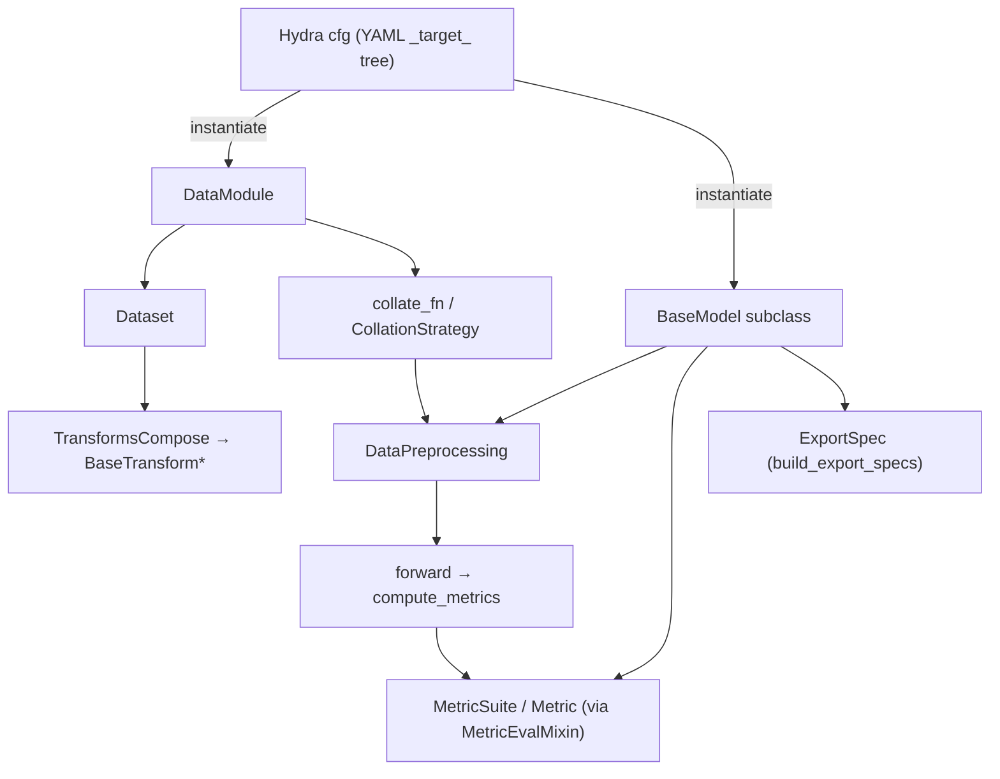

# Code Walkthrough — Important Classes

> A reference card of the ~10 classes you will touch most. Keep it open while reading code.
> Each entry: where it lives, why it exists, its key methods, and the gotchas. Deeper
> treatment is linked per area.

The framework's whole contract rests on **three base classes** plus a handful of
supporting types:

```text
BaseModel        (models/base.py)          ← every model IS a LightningModule
DataModule       (datamodule/base.py)      ← owns dataloaders + collation
Dataset          (datamodule/base.py)      ← returns metadata; transforms do the loading
+ BaseTransform / TransformsCompose        ← CPU augmentation
+ DataPreprocessing                        ← GPU per-batch shaping
+ MetricSuite / Metric / MetricEvalMixin   ← epoch evaluation
+ ExportSpec                               ← deployment contract
```

---

## `BaseModel` — `autoware_ml/models/base.py:42`

```python
class BaseModel(MetricEvalMixin, L.LightningModule, ABC):
```

**Why it exists:** so every model shares one training/val/test/predict path, one optimizer
setup, one metric-logging mechanism, and one export contract — leaving the model author to
write only the network and the loss.

**You must implement (abstract):**

| Method | Contract |
| ------ | -------- |
| `forward(self, **kwargs)` (`:188`) | Any signature. The base passes only batch keys whose names match your parameters. |
| `compute_metrics(self, batch, outputs)` (`:204`) | Return a dict that **must** contain `"loss"`. Receives the *full* batch + forward outputs. |

**You inherit (don't override unless noted):**

| Method / attr | What it does | Line |
| ------------- | ------------ | ---- |
| `__init__(optimizer, scheduler, optimizer_group_overrides, scheduler_config, metrics)` | Stores optimizer/scheduler **partials**; builds `forward_signature`; sets empty `DataPreprocessing`. | `:50` |
| `self.forward_signature = inspect.signature(self.forward)` | Captured **once** at construction; drives batch-key filtering. | `:71` |
| `_shared_step(batch, prefix, **kw)` | Filters batch → `forward` kwargs, runs forward, calls `compute_metrics`, asserts `"loss"`, logs. | `:239` |
| `training_step` / `validation_step` / `test_step` / `predict_step` | `@final` — you cannot override them. train returns `loss`; val/test also return `{"model_outputs": ...}` for metrics. | `:270`–`:356` |
| `on_after_batch_transfer(batch, idx)` | Runs the model-owned `DataPreprocessing` on-device, per batch. | `:94` |
| `set_data_preprocessing(dp)` | Installs the preprocessing pipeline (called by the entrypoint). | `:80` |
| `predict_outputs(batch, outputs)` | Default returns outputs unchanged; override for prediction-time formatting. | `:109` |
| `get_log_batch_size(batch)` | Sample count for logging; override for ragged point clouds. | `:219` |
| `build_export_specs(batch)` / `build_export_spec(batch)` | Deployment: default wraps the model as one `end_to_end` ONNX module; override for split exports. | `:380` / `:358` |
| `configure_optimizers()` | Builds optimizer+scheduler from the partials via `build_lightning_optimizer_config`. | `:395` |

**The signature-inspection trick (the thing that surprises everyone):**

```python
# _shared_step, base.py:253
forward_inputs = {k: batch[k] for k in self.forward_signature.parameters if k in batch}
outputs = self(**forward_inputs)
```

Only batch keys matching `forward`'s parameter *names* are passed. So `forward(self, voxels,
num_points, voxel_coords)` receives exactly those three; `gt_boxes`/`gt_labels` are withheld
from `forward` but remain available to `compute_metrics`. **Consequence:** your `forward`
parameter names are an API — they must equal batch keys (after preprocessing).

**Gotchas:**
- `compute_metrics` must return `"loss"` or `_shared_step` raises (`:260`).
- The step methods are `@final`; extend behavior via the hooks, not by overriding steps.
- Optimizer/scheduler arrive as callables (partials), not instances — see below.

Deep dive: [../model/model_architecture.md](../model/model_architecture.md).

---

## `Dataset` — `autoware_ml/datamodule/base.py:76`

```python
class Dataset(TorchDataset, ABC):
    def __getitem__(self, index):                       # :93
        input_dict = self.get_data_info(index)
        context = PipelineContext(dataset=self, index=index)
        return self.apply_transforms(input_dict, self.dataset_transforms, context)

    @abstractmethod
    def get_data_info(self, index) -> dict: ...          # :106  YOU implement this
```

**Why it exists:** to separate "which samples exist + their metadata" (the dataset's job)
from "load the files + augment" (the transforms' job).

**Contract:** `get_data_info` returns a **plain metadata dict** (paths, raw annotations,
calibration) — **not tensors, not loaded files.** Loading happens in transforms. This keeps
datasets tiny and makes loading composable/configurable.

Deep dive: [../dataset/dataset_pipeline.md](../dataset/dataset_pipeline.md).

---

## `DataModule` — `autoware_ml/datamodule/base.py:139`

```python
class DataModule(L.LightningDataModule, ABC):
    def __init__(self, collation_map=None,
                 train_transforms=None, val_transforms=None, test_transforms=None, predict_transforms=None,
                 train_dataloader_cfg=None, val_dataloader_cfg=None, test_dataloader_cfg=None, predict_dataloader_cfg=None): ...

    @abstractmethod
    def _create_dataset(self, split, dataset_transforms=None) -> Dataset: ...   # :249  YOU implement
```

**Why it exists:** one place that owns per-split transforms, per-split dataloader configs,
and the collation strategy — so a new dataset only implements `_create_dataset`.

**Key methods:**

| Method | Role | Line |
| ------ | ---- | ---- |
| `setup(stage)` | Maps `fit`→`[train,val]`, `test`→`[test]`, … and builds each split's dataset via `_create_dataset`. | `:268` |
| `_create_dataloader(split)` | Wraps the split dataset in a `DataLoader(collate_fn=self.collate_fn, **cfg)`. | `:298` |
| `train/val/test/predict_dataloader()` | Thin delegates to `_create_dataloader`. | `:311`–`:325` |
| `collate_fn(batch)` | The batching engine, driven by `collation_map`. | `:423` |

**`DataLoaderConfig`** (`:40`) is a dataclass (`batch_size`, `num_workers`, `pin_memory`,
`persistent_workers`, `shuffle`, `drop_last`); `_coerce_dataloader_cfg` normalizes dict /
`DictConfig` / dataclass at the Hydra boundary.

Deep dive: [../dataset/dataset_pipeline.md](../dataset/dataset_pipeline.md).

---

## `collate_fn` + `CollationStrategy` — `datamodule/base.py:423`, `datamodule/collation.py`

`collation_map` is a **strict whitelist**: only listed keys reach the batch; unlisted keys
are dropped; listed-but-missing keys warn and skip (expected in predict/deploy).

| Strategy | Behavior | Note |
| -------- | -------- | ---- |
| `stack` (`:468`) | `torch.stack`; all shapes must match | raises `ValueError` on shape mismatch |
| `concat` (`:470`) | `torch.cat(dim=0)`; the **first** concat key sets `batch["offset"]` (cumulative lengths) | for variable-length point clouds |
| `index_concat` (`:476`) | concat + shift indices by the primary space's exclusive offset | requires a `concat` key to exist |
| `list` (`:478`) | keep as a Python list, per-sample | CenterPoint uses this for `points`/`gt_boxes`/`gt_labels` |

`"offset"` is a **reserved** key — declaring it in `collation_map` raises (`:200`).
`_coerce_value` (`:327`) converts numpy→tensor but preserves numpy scalar dtypes (so float64
timestamps aren't quantized).

Deep dive: [../architecture/data_flow.md](../architecture/data_flow.md).

---

## `BaseTransform` / `TransformsCompose` — `autoware_ml/transforms/base.py`

**Why:** composable, per-sample, CPU-side loading + augmentation with a uniform
**dict-in / dict-out** contract.

```python
class BaseTransform(ABC):
    p = None                       # application probability (None = always)
    _required_keys = ()            # KeyError if absent
    def __call__(self, input_dict, context=None):
        # validate required keys → apply optional-key defaults → probability gate → transform()
        ...
    @abstractmethod
    def transform(self, input_dict) -> dict: ...     # returns updates to MERGE

class TransformsCompose:
    def __call__(self, input_dict, context=None):
        for t in self.pipeline:
            input_dict |= t(input_dict, context=context)   # merge each transform's output
        return input_dict
```

**Gotchas:**
- A transform returns *only the keys it changes*; the composer merges with `|=`.
- Geometry transforms must transform `points` **and** `gt_boxes` jointly, or boxes drift.
- `_target_` points at the concrete implementation module (no `__init__` re-exports).
- The active `PipelineContext` is reachable via `self.context` (for mixing augmentations).

Deep dive: [../dataset/augmentation.md](../dataset/augmentation.md).

---

## `DataPreprocessing` — `autoware_ml/preprocessing/base.py`

```python
class DataPreprocessing:
    def __init__(self, pipeline=()): self.pipeline = list(pipeline)
    def __call__(self, batch):                    # runs on the GPU, per batch
        for layer in self.pipeline:
            batch |= layer(batch)
        return batch
```

**Why separate from transforms:** transforms are per-sample on CPU (in workers); this is
per-batch on GPU, and it is **model-owned** (installed via `set_data_preprocessing`, run in
`BaseModel.on_after_batch_transfer`). Heavy, model-specific ops like voxelization live here
(e.g. `PointPillarPreprocessor` adds `voxels`, `num_points`, `voxel_coords`).

Deep dive: [../dataset/dataset_pipeline.md](../dataset/dataset_pipeline.md).

---

## `MetricSuite` / `Metric` / `MetricEvalMixin` — `autoware_ml/metrics/`

**Why:** epoch-level evaluation (mAP, NDS, IoU) that reduces correctly across GPUs and
reports per distance range — decoupled from losses.

| Type | Role | Location |
| ---- | ---- | -------- |
| `MetricSuite(torchmetrics.Metric)` | The state-engine: accumulates per-batch state, syncs across GPUs, dispatches per range. | `metrics/base.py` |
| `Metric` | A small injectable strategy (`MeanAP`, `Nds`, `IoU`, …) that reads the suite's state and declares its `stages`. | `metrics/base.py` |
| `MetricEvalMixin` | Mixed into `BaseModel`; drives the reset/update/compute lifecycle via Lightning hooks. | `metrics/eval_mixin.py` |

**What a model provides:** one method, `build_eval_output(batch, outputs)`, mapping raw
forward outputs to the flat dict the suites read (e.g. `{predictions, gt_boxes, gt_labels}`).
The model never calls `update`/`compute`. Keys are logged as `{split}/{prefix}/{key}`, e.g.
`val/det3d/mAP`.

Deep dive: [../evaluation/evaluation_pipeline.md](../evaluation/evaluation_pipeline.md).

---

## `ExportSpec` — `autoware_ml/utils/deploy.py`

The deployment contract a model returns from `build_export_specs`:

```python
@dataclass(frozen=True)
class ExportSpec:
    module: torch.nn.Module                 # the exact submodule/wrapper to export
    args: tuple[Any, ...]                   # example inputs
    input_param_names: list[str]
    output_names: list[str] | None
    dynamic_axes: dict | None               # legacy path (dynamo=False)
    supported_stages: frozenset[str] = frozenset({"onnx", "tensorrt"})
```

Default: the whole model is one `end_to_end` module. Models like CenterPoint/BEVFusion
override `build_export_specs` to emit **several** modules (e.g. voxel-encoder and
backbone-neck-head separately). PTv3 sets `supported_stages = {"onnx"}` (no TensorRT).

Deep dive: [../deployment/export_pipeline.md](../deployment/export_pipeline.md).

---

## How they connect (one diagram)



---

## Quick "where do I put X?" table

| I want to change… | Class | File |
| ----------------- | ----- | ---- |
| The network / loss | your `BaseModel` subclass | `models/<task>/<model>.py` |
| Which samples exist / their metadata | `Dataset` subclass | `datamodule/<dataset>/<task>.py` |
| Batch size / workers / transforms per split | `DataModule` subclass + config | `datamodule/...` + leaf YAML |
| How keys are batched | `collation_map` | leaf/base YAML |
| GPU per-batch shaping (voxelization) | `DataPreprocessing` layer | `preprocessing/...` + `cfg.data_preprocessing` |
| A CPU augmentation | `BaseTransform` subclass | `transforms/...` |
| A metric | `Metric` subclass + suite config | `metrics/...` + dataset YAML |
| What/how to export | `build_export_specs` override | your model class |

---

**Phase 1 complete.** You now understand the framework's shape, its runtime flow, its data
flow, and its key classes. Continue to the deep dives:
[../dataset/](../dataset/dataset_pipeline.md) · [../model/](../model/model_architecture.md) · [../training/](../training/training_loop.md) ·
[../evaluation/](../evaluation/evaluation_pipeline.md) · [../deployment/](../deployment/export_pipeline.md).
