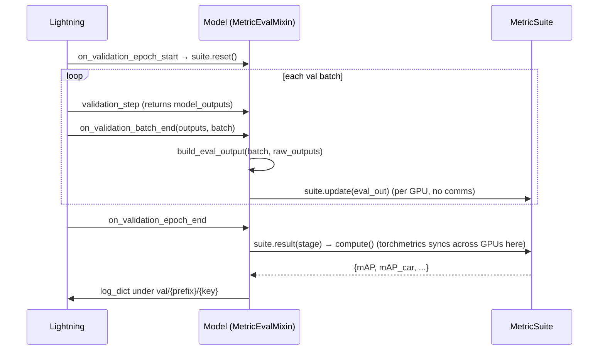

# Evaluation Pipeline

> **What this covers:** how validation/test turn model predictions into epoch-level metrics —
> the `MetricSuite`/`Metric` split, the `MetricEvalMixin` lifecycle, and why it's separate
> from losses. The concrete metrics (mAP, NDS, IoU) are in [metrics.md](metrics.md).
>
> Prerequisites: [../model/model_architecture.md](../model/model_architecture.md),
> [../training/training_loop.md](../training/training_loop.md).

---

## 1. Losses vs metrics — two different mechanisms

| | Loss | Metric |
| --- | --- | --- |
| Computed | every step (train/val/test) | at epoch end (val/test only) |
| Owner | the model/head (`compute_metrics`) | `MetricSuite` objects attached to the model |
| Granularity | per batch, scalar | accumulated over the whole epoch |
| Cross-GPU | Lightning averages the scalar (`sync_dist`) | torchmetrics reduces per-state, then computes once |
| Purpose | optimize | report quality (mAP, NDS, IoU) |

Metrics are **not** run in `validation_step`. They're driven by `MetricEvalMixin` (mixed into
`BaseModel`) via Lightning's epoch/batch hooks. Which metrics run in which split is **pure
config**.



---

## 2. The two-role design (`metrics/base.py`)

The framework splits evaluation into a **state-engine** and **strategies**:

- **`MetricSuite(torchmetrics.Metric)`** — owns the accumulated state and its cross-GPU
  reduction (`add_state`), and the per-range dispatch. It does *not* decide which numbers to
  compute. It implements two abstract methods: `update(eval_out)` (fold a batch into state) and
  `state_for(range)` (build the state object metrics read, overall or per distance range).
- **`Metric`** — a small, stateless, injectable strategy. It implements `evaluate(state,
  stage)` and declares its `stages`. It reads the suite's state and returns its slice of the
  report.

```python
class Metric(ABC, Generic[StateT]):
    def __init__(self, stages=("val", "test")):
        self.stages = frozenset(EvalStage(s) for s in stages)   # when this metric runs
    @abstractmethod
    def evaluate(self, state, stage) -> dict[str, float]: ...

class MetricSuite(torchmetrics.Metric, ABC, Generic[StateT]):
    prefix: str = ""
    _required_keys: tuple[str, ...] = ()
    @abstractmethod
    def update(self, eval_out): ...                    # accumulate one batch
    @abstractmethod
    def state_for(self, metric_range): ...             # build state overall / per range
    def compute(self):                                  # runs every stage-applicable metric
        report = self._run(self.state_for(None), suffix="")
        for r in self.ranges:
            report.update(self._run(self.state_for(r), range_suffix(r)))
        return report
```

**Why this split?** Adding a metric means writing a `Metric` subclass and listing it in
config — never editing the suite. The suite is the reusable engine; metrics are pluggable. A
new metric family that needs *new state* is a new suite.

---

## 3. What a model provides: `build_eval_output` (one method)

The only thing a model implements for evaluation is a mapping from raw forward outputs to the
flat dict the suite reads. For detection it's a one-liner delegating to a shared helper:

```python
# CenterPointDetectionModel
def build_eval_output(self, batch, outputs):
    return detection_eval_output(self.bbox_head.predict(outputs), batch)
```

```python
# metrics/detection3d/eval_output.py
def detection_eval_output(predictions, batch):
    return {
        "predictions": predictions,       # decoded [{bboxes_3d, scores_3d, labels_3d}, ...]
        "gt_boxes":    batch["gt_boxes"],
        "gt_labels":   batch["gt_labels"],
        "gt_num_points": batch.get("gt_num_points"),
    }
```

The model **never** calls `update`/`compute`/`result` — the mixin does. Model-specific work
(box decoding) happens here, in `build_eval_output`/`predict`.

---

## 4. The lifecycle in code (`metrics/eval_mixin.py`)

```python
class MetricEvalMixin:
    def __init__(self, *args, metrics=None, **kwargs):
        super().__init__(*args, **kwargs)
        prototypes = list(metrics) if metrics else []
        self._metrics_by_stage = nn.ModuleDict({          # CLONE per stage → registered submodules
            "val":  nn.ModuleList([m.clone() for m in prototypes]),
            "test": nn.ModuleList([m.clone() for m in prototypes]),
        })

    def on_validation_epoch_start(self):  # reset state
        for m in self._stage_metrics(EvalStage.VAL): m.reset()

    def on_validation_batch_end(self, outputs, batch, batch_idx, dataloader_idx=0):
        self._update_metrics(EvalStage.VAL, outputs, batch, batch_idx)

    def _update_metrics(self, stage, outputs, batch, batch_idx):
        raw = outputs["model_outputs"] if isinstance(outputs, Mapping) and "model_outputs" in outputs else outputs
        eval_out = self.build_eval_output(batch, raw)          # ← model's method
        if batch_idx == 0: self._check_required_keys(metrics, eval_out)   # fail fast if a key is missing
        for m in metrics: m.update(eval_out)

    def on_validation_epoch_end(self):
        self._log_metrics(EvalStage.VAL)

    def _log_metrics(self, stage):
        report = {}
        for m in self._stage_metrics(stage):
            for name, value in m.result(stage).items():
                report[f"{stage.value}/{m.prefix}/{name}"] = value       # e.g. val/det3d/mAP
        self.log_dict(report, on_step=False, on_epoch=True, logger=True)  # no sync_dist — already synced
```

Key points:

- **Suites are cloned per stage** and registered as submodules, so Lightning moves their state
  to the right device and torchmetrics can sync.
- **`validation_step` stashes `model_outputs`** (recall `return {**metrics, "model_outputs":
  outputs}`); the mixin unwraps that here.
- **Fail fast:** on batch 0 it checks the suite's `_required_keys` against `build_eval_output`'s
  output, so a mismatch raises immediately with a clear message.
- **Keys:** `{split}/{prefix}/{key}` — `val/det3d/mAP`, `test/seg3d/iou_car_0m_50m`, etc.
  Checkpoint monitors and Optuna targets point at these directly.

---

## 5. What runs in each split

| Split | Losses | Metrics |
| ----- | ------ | ------- |
| train | logged | **not run** |
| val | logged | metrics whose `stages` include `val` |
| test | logged | metrics whose `stages` include `test` |
| predict | not run | not run |

Convention: cheap headline metrics (mAP) run in both `val` and `test`; heavier reporting
(NDS, TP errors, per-threshold curves) runs only in `test`, keeping validation epochs fast.
This is set per metric in config, not in code.

---

## 6. Distributed correctness

- **State reduction** is per-state, declared via `add_state(..., dist_reduce_fx=...)`.
  Segmentation uses one stacked confusion matrix reduced with `sum` (counts are additive).
  Detection keeps per-frame prediction/GT tensors as list states with **no** reduction
  (`dist_reduce_fx=None`), because mAP matching is score-ordered *within a frame* and must stay
  per-frame after the gather.
- After sync the state is identical on every rank, so `_log_metrics` logs **without**
  `sync_dist`.
- `autoware-ml test` runs on a single device by default (exact metrics, no padding). Multi-GPU
  validation pads the last batch, double-counting at most `world_size - 1` frames — negligible
  and left uncorrected (see `docs/framework/metrics.md`).

---

## Common debugging cases

| Symptom | Cause | Fix |
| ------- | ----- | --- |
| Metrics never appear (only losses) | model didn't override `build_eval_output`, or `model.metrics` empty | implement `build_eval_output`; attach suites in config |
| `Metric 'X' needs [...] not produced by ... build_eval_output` | `build_eval_output` missing a required key | add the key (e.g. `gt_num_points`) |
| `Two metrics log the same key` | duplicate keys across suites | give a suite a distinct `prefix` |
| mAP is `nan` | no valid labels/predictions accumulated | check class filtering, ranges, and that `predict` returns boxes |
| Metrics differ slightly on multi-GPU | validation padding double-counts a few frames | run `autoware-ml test` (single device) for exact numbers |
| Checkpoint monitor can't find metric | monitor key ≠ logged key | use `{split}/{prefix}/{key}`, e.g. `val/det3d/mAP` |

---

## Common modification scenarios

| I want to… | Do this |
| ---------- | ------- |
| Add metrics to a model | override `build_eval_output`; add a suite to `model.metrics` in config |
| Run a metric only at test | set its `stages: [test]` in config |
| Add a new metric to an existing suite | write a `Metric` subclass; list it in the suite's `components` |
| Add a whole new metric family (new state) | write a new `MetricSuite` (implement `update`/`state_for`) |
| Monitor a metric for checkpointing | `callbacks.model_checkpoint.monitor=val/det3d/mAP mode=max` |

---

**Next:** [metrics.md](metrics.md) — the concrete detection and segmentation metrics.
