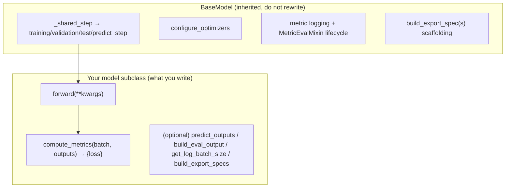

# Model Architecture

> **What this covers:** the `BaseModel` contract in depth, how a concrete model
> (CenterPoint) is assembled from backbone/neck/head pieces, and how to add your own model.
> The sub-parts get their own docs: [backbone.md](backbone.md), [neck.md](neck.md),
> [head.md](head.md).
>
> Prerequisite: [../code_walkthrough/important_classes.md](../code_walkthrough/important_classes.md)
> (the `BaseModel` reference card).

---

## 1. What a "model" is in this framework

A model is a subclass of **`BaseModel`**, which *is* a `lightning.LightningModule`. It is a
**thin wrapper** that:

1. holds already-built sub-modules (`nn.Module`s built by Hydra),
2. defines `forward()` (the network) and `compute_metrics()` (the loss),
3. optionally overrides a few hooks (`predict_outputs`, `build_eval_output`,
   `get_log_batch_size`, `build_export_specs`).

Everything else — the train/val/test/predict steps, optimizer setup, metric logging, and the
export scaffolding — is inherited. The design goal: **a model author writes the network and
the loss, nothing else.**



---

## 2. The `BaseModel` contract (`models/base.py:42`)

```python
class BaseModel(MetricEvalMixin, L.LightningModule, ABC):
    def __init__(self, optimizer=None, scheduler=None,
                 optimizer_group_overrides=None, scheduler_config=None, metrics=None):
        super().__init__(metrics=metrics)                       # MetricEvalMixin → LightningModule
        self.forward_signature = inspect.signature(self.forward)   # :71  captured ONCE
        self.optimizer_partial = optimizer                      # a functools.partial (from _partial_)
        self.scheduler_partial = scheduler
        self._data_preprocessing = DataPreprocessing()          # empty until set_data_preprocessing()

    @abstractmethod
    def forward(self, **kwargs) -> Any: ...                     # any signature
    @abstractmethod
    def compute_metrics(self, batch, outputs) -> dict: ...      # MUST return "loss"
```

### The unified step (`_shared_step`, `base.py:239`)

```python
def _shared_step(self, batch, step_prefix, **kwargs):
    forward_inputs = {k: batch[k] for k in self.forward_signature.parameters if k in batch}   # :253
    outputs = self(**forward_inputs)                            # :258  forward()
    metrics = self.compute_metrics(batch, outputs)             # :259  loss (+ extra scalars)
    if "loss" not in metrics:
        raise ValueError("compute_metrics() must return a dict containing a 'loss' key.")     # :260
    batch_size = self.get_log_batch_size(batch)
    self.log_dict({f"{step_prefix}/{k}": v for k, v in metrics.items()}, batch_size=batch_size, **kwargs)
    return metrics, outputs
```

Three consequences worth memorizing:

1. **Signature filtering.** Only batch keys whose names equal `forward` parameters are passed.
   `forward(self, voxels, num_points, voxel_coords)` gets exactly those three; `gt_boxes`
   never enters `forward` but is still in `batch` for `compute_metrics`. **Your `forward`
   parameter names are a public API — they must match batch keys after preprocessing.**
2. **`"loss"` is mandatory.** `compute_metrics` must return it, or the step raises.
3. **All step methods are `@final`.** `training_step`/`validation_step`/`test_step`/
   `predict_step` (`base.py:270`–`356`) cannot be overridden — customize via hooks instead.
   - `training_step` returns `metrics["loss"]` (Lightning back-props it).
   - `validation_step`/`test_step` return `{**metrics, "model_outputs": outputs}` so the
     metric suites can accumulate the raw outputs at epoch end (see
     [../evaluation/evaluation_pipeline.md](../evaluation/evaluation_pipeline.md)).

### The hooks you may override

| Hook | Default | Override when… | Line |
| ---- | ------- | -------------- | ---- |
| `predict_outputs(batch, outputs)` | returns outputs unchanged | prediction differs from training output (decode boxes, argmax) | `:109` |
| `build_eval_output(batch, outputs)` | `{}` (via mixin) | the model has metrics — map outputs → the flat dict suites read | `metrics/eval_mixin.py` |
| `get_log_batch_size(batch)` | Lightning's inference on forward inputs | ragged inputs (point clouds) — return the true sample count | `:219` |
| `build_export_specs(batch)` | one `end_to_end` ONNX module | you need split export modules | `:380` |
| `on_after_batch_transfer` | runs `DataPreprocessing` | rarely — it already runs your configured pipeline | `:94` |

---

## 3. A concrete model: `CenterPointDetectionModel` (`models/detection3d/centerpoint.py:73`)

This is the canonical, cleanly-traceable detector. Read it as the template for "how much code
a model actually is" — the answer is *very little*.

```python
class CenterPointDetectionModel(BaseModel):
    def __init__(self, pts_voxel_encoder, pts_middle_encoder, pts_backbone, pts_neck, bbox_head,
                 optimizer=None, scheduler=None, metrics=None):
        super().__init__(optimizer=optimizer, scheduler=scheduler, metrics=metrics)
        self.pts_voxel_encoder = pts_voxel_encoder     # PillarFeatureNet   (an ENCODER)
        self.pts_middle_encoder = pts_middle_encoder   # PointPillarsScatter (voxel → dense BEV)
        self.pts_backbone = pts_backbone               # SECONDBackbone     (see backbone.md)
        self.pts_neck = pts_neck                       # SECONDFPN          (see neck.md)
        self.bbox_head = bbox_head                     # CenterHead         (see head.md)

    def forward(self, voxels, num_points, voxel_coords):           # :114
        batch_size = infer_batch_size_from_voxel_coords(voxel_coords)
        point_features = self.pts_voxel_encoder(voxels, num_points, voxel_coords)
        bev_features   = self.pts_middle_encoder(point_features, voxel_coords, batch_size=batch_size)
        bev_features   = self.pts_backbone(bev_features)           # → list of multi-scale maps
        bev_features   = self.pts_neck(bev_features)               # → one fused BEV tensor
        return self.bbox_head(bev_features)                        # → {heatmap, reg, height, dim, rot[, vel]}

    def compute_metrics(self, batch, outputs):                     # :137
        return self.bbox_head.loss(outputs, batch["gt_boxes"], batch["gt_labels"])   # {"loss", "loss_heatmap", "loss_bbox"}

    def predict_outputs(self, batch, outputs):                     # :147
        return self.bbox_head.predict(outputs)                     # decoded boxes/scores/labels

    def build_eval_output(self, batch, outputs):                   # :110  feeds the metric suite
        return detection_eval_output(self.bbox_head.predict(outputs), batch)

    def get_log_batch_size(self, batch):                           # :154
        return len(batch["gt_boxes"])                              # sample count, not voxel count
```

The constructor takes **already-built** `nn.Module`s — Hydra built each from its `_target_`
before calling this constructor (see [../code_walkthrough/config_flow.md](../code_walkthrough/config_flow.md)).
The model just wires them and delegates loss/decode to the **head**. Note the repeated
pattern: **the head owns the loss and the decoding**; the model wrapper just calls
`bbox_head.loss(...)` and `bbox_head.predict(...)`.

### The staged architecture (encoder → middle → backbone → neck → head)

```text
voxels, num_points, voxel_coords
   │  PillarFeatureNet (pts_voxel_encoder)          per-pillar feature vectors
   ▼
   │  PointPillarsScatter (pts_middle_encoder)      scatter pillars → dense BEV grid (C,H,W)
   ▼
   │  SECONDBackbone (pts_backbone)                 staged 2D convs → multi-scale BEV maps [s1,s2,s3]
   ▼
   │  SECONDFPN (pts_neck)                          upsample + concat → one fused BEV tensor
   ▼
   │  CenterHead (bbox_head)                        dense heatmap + regression maps
   ▼
   {heatmap, reg, height, dim, rot, vel}
```

Terminology note specific to this repo: the **voxel encoder** and **scatter** are *encoders*
(`models/detection3d/encoders/`), the 2D CNN is the *backbone*
(`models/detection3d/backbones/`), the multi-scale fusion is the *neck*
(`models/detection3d/necks/`), and the dense predictor is the *head*
(`models/detection3d/heads/`). Different detectors reuse these building blocks differently.

---

## 4. The model inventory

Every model subclasses `BaseModel` (PTv3 variants via an intermediate `PTv3BaseModel`).

| Task | Models (`autoware_ml/models/...`) |
| ---- | --------------------------------- |
| **detection3d** | `CenterPointDetectionModel`, `BEVFusionDetectionModel` (lidar+camera), `TransFusionDetectionModel`, `StreamPETRDetectionModel` (camera/temporal), `PTv3DetectionModel` |
| **segmentation3d** | `FRNet`, `PTv3SegmentationModel` |
| **multi** | `PTv3SegDetModel` (joint seg + detection) |
| **calibration_status** | `CalibrationStatusClassifier` |

The most architecturally complete is **BEVFusion** (two-branch lidar+camera BEV with a fusion
layer before the shared backbone/neck/head); the cleanest to learn from is **CenterPoint**.
`PTv3` is the flagship used in most docs/examples.

### Where building blocks live

| Tier | Location | Examples |
| ---- | -------- | -------- |
| **Shared, cross-task** | `models/common/` | `backbones/` (`ResNet18/50`, `VoVNet…`), `necks/` (`CPFPN`, `GeneralizedLSSFPN`, `GlobalAveragePooling`), `heads/` (`LinearClsHead`), `layers/` (`ConvModule`), `grid_mask.py` |
| **Task-specific** | `models/detection3d/` | `backbones/` (`SECONDBackbone`), `necks/` (`SECONDFPN`), `encoders/` (`PillarFeatureNet`, `PointPillarsScatter`, `SparseEncoder`), `heads/` (`CenterHead`, `TransFusionHead`, `StreamPETRHead`), `view_transforms/`, `fusion.py`, `task_modules/` (assigners, bbox coders) |

---

## 5. Adding a model (the minimal recipe)

From `docs/contributing/adding-models.md`, the minimal contract is two methods:

```python
# autoware_ml/models/my_task/my_model.py
from autoware_ml.models.base import BaseModel

class MyModel(BaseModel):
    def __init__(self, encoder, decoder, num_classes, **kwargs):   # kwargs → optimizer/scheduler/metrics
        super().__init__(**kwargs)
        self.encoder, self.decoder = encoder, decoder
        self.loss_fn = nn.CrossEntropyLoss()

    def forward(self, input_tensor):                # param names MUST match batch keys
        return self.decoder(self.encoder(input_tensor))

    def compute_metrics(self, batch, outputs):
        logits = outputs[0] if isinstance(outputs, (list, tuple)) else outputs
        loss = self.loss_fn(logits, batch["gt_labels"])
        return {"loss": loss, "accuracy": (logits.argmax(1) == batch["gt_labels"]).float().mean()}
```

Then:
1. **Config** (`configs/tasks/my_task/my_model/base.yaml`): `model._target_` = your class, with
   `_target_` sub-modules for `encoder`/`decoder`, `_partial_` optimizer/scheduler, and a
   `data_preprocessing` block if needed.
2. **DataModule** for your data (see [../dataset/dataset_pipeline.md](../dataset/dataset_pipeline.md)).
3. Train: `autoware-ml train --config-name my_task/my_model/my_variant_my_dataset`.

Naming convention for the leaf config: `<task>/<model>/<variant>_<dataset>`, e.g.
`detection3d/centerpoint/voxel020_second_secfpn_51m_nuscenes`.

**When the default path isn't enough**, override hooks (don't build a standalone
`LightningModule`):

```python
def forward(self, image, lidar):                    # multiple inputs → multiple batch keys
    return self.head(torch.cat([self.img_enc(image), self.lidar_enc(lidar)], dim=1))

def predict_outputs(self, batch, outputs):          # decode at inference time
    return decode(outputs)
```

---

## Common debugging cases

| Symptom | Cause | Fix |
| ------- | ----- | --- |
| `KeyError` for a `forward` arg | that batch key wasn't produced/collated | ensure a transform/preprocessing makes it **and** it's in `collation_map` |
| `compute_metrics() must return a dict containing a 'loss' key` | forgot `"loss"` | return it |
| Extra batch keys ignored by `forward` | signature filtering (by design) | read those keys in `compute_metrics` instead |
| Metrics never logged, only losses | model didn't override `build_eval_output`, or `metrics` empty | implement `build_eval_output`; set `model.metrics` in config |
| `configure_optimizers`: "Optimizer must be provided" | no `optimizer` in config | add `optimizer` with `_partial_: true` |
| Wrong logged batch size | ragged inputs confuse Lightning's inference | override `get_log_batch_size` (CenterPoint returns `len(gt_boxes)`) |
| Can't override `training_step` | it's `@final` | use hooks (`predict_outputs`, `on_after_batch_transfer`, …) |

---

## Common modification scenarios

| I want to… | Do this |
| ---------- | ------- |
| Add a model | Subclass `BaseModel` (`forward`+`compute_metrics`) + a config; see §5 |
| Swap a backbone/neck/head | Change that sub-module's `_target_` in the config (no Python change if interfaces match) |
| Add an auxiliary loss | Return an extra key from `compute_metrics` (e.g. `loss_aux`); add it into `"loss"` |
| Change what predictions look like | Override `predict_outputs` |
| Add metrics to a model | Override `build_eval_output`; add suites to `model.metrics` in config |
| Multi-modal input | Give `forward` multiple params; ensure matching batch keys |

---

**Next:** [backbone.md](backbone.md) · [neck.md](neck.md) · [head.md](head.md).
