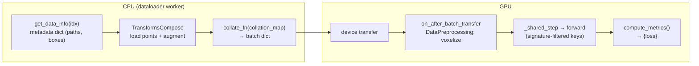

# 資料流（Data Flow）— 一筆 sample 從硬碟到 loss 值的旅程

> [execution_flow.md](execution_flow.md) 追蹤的是*控制*流。這篇文件追蹤的則是*資料*流：
> 一筆訓練用的 sample 如何變成一個 batch、抵達 GPU、產生預測，並轉換成一個 loss 值。
> 我們以 **LiDAR dataset 上的 CenterPoint** 作為貫穿全文的範例，因為它能乾淨俐落地
> 走過每一個階段。
>
> 深入閱讀：[../dataset/dataset_pipeline.md](../dataset/dataset_pipeline.md) 與
> [../dataset/augmentation.md](../dataset/augmentation.md)。

---

## 七個跳躍點（hop）

```text
(1) info record        get_data_info(index)              dict of metadata (paths, boxes, calib)
        │
(2) transforms         TransformsCompose (CPU, worker)   load points, augment  → sample dict
        │
(3) collation          collate_fn + collation_map        batch dict of lists/tensors
        │
(4) device transfer    Lightning moves batch to GPU
        │
(5) preprocessing      on_after_batch_transfer           DataPreprocessing: voxelize (GPU)
        │
(6) forward            BaseModel._shared_step → forward   predictions
        │
(7) loss / metrics     compute_metrics()                 {"loss": ...}  (+ eval accumulation)
```

有兩條設計規則主宰了整條路徑，也解釋了大多數的「意外」：

1. **`get_data_info` 回傳的是中繼資料（metadata），不是 tensor。** 檔案載入是發生在
   **transforms** 裡，而不是在 dataset 裡。dataset 只負責說「這筆 sample 存在，
   而且可以在這裡找到它」。
2. **`collation_map` 是一份嚴格的白名單。** 只有列在 `collation_map` 中的 key
   才會存活進入 batch。任何 transform 產生出來、但沒有被列入白名單的 key，
   都會在模型看到它之前就被**悄悄丟棄**。這是「為什麼我的 key 在 `forward` 裡
   不見了？」這類困惑的頭號成因。

---

## 跳躍點 1 — info 紀錄（`Dataset.get_data_info`）

`autoware_ml/datamodule/base.py` 定義了抽象的 `Dataset`。`__getitem__` 做的事情是：

```python
def __getitem__(self, index):
    input_dict = self.get_data_info(index)                       # abstract, per dataset
    context = PipelineContext(dataset=self, index=index)         # orchestration state
    return self.apply_transforms(input_dict, self.dataset_transforms, context)
```

以 LiDAR detection（`datamodule/t4dataset/detection3d.py`）為例，`get_data_info(index)`
回傳的是像這樣的一個普通 dict：

```python
{
  "instances":   [...],           # raw annotation records
  "class_names": [...],
  "name_mapping": {...},
  "lidar_path":  "/abs/path/....pcd.bin",   # a PATH, not points
  "sweeps":      [...],           # historical frames for multi-sweep
  "num_pts_feats": 5,
  "sample_token": "...", "timestamp": ...,
}
```

注意：**這時候還沒有點雲** — 只有一個路徑。標註檔本身（`.pkl`）已經在
dataset 的 `__init__` 中載入過一次了。

> `PipelineContext`（`datamodule/pipeline_context.py`）帶著 `dataset`、`index`
> 以及一個 RNG。它讓 transform 可以取得*第二筆* sample（`sample_secondary`），
> 用於混合類型的增強（例如 copy-paste），而不需要把這套機制塞進 sample dict 裡。

---

## 跳躍點 2 — transforms（CPU，在 dataloader worker 中）

`apply_transforms` 會執行一個 `TransformsCompose` — 一份依序排列的 `BaseTransform` 清單，
每一個都是**dict-in / dict-out**：讀取一些 key，回傳更新內容，再由 composer
把它們合併起來（`input_dict |= transform(input_dict)`）。以 CenterPoint 的訓練 pipeline
為例，順序大致如下：

| # | Transform | 讀取 → 寫入 |
| - | --------- | -------------- |
| 1 | `MergeObjects3D` | `instances` → 合併後的 `instances` |
| 2 | `LoadAnnotations3D` | `instances` → `gt_boxes (N,9)`、`gt_names`、`gt_labels`、`gt_num_points` |
| 3 | `LoadPointsFromMultiSweeps` | `lidar_path`,`sweeps` → `points`（附帶每個點的時間差欄位） |
| 4 | `GlobalRotScaleTrans` | 同時對 `points` **與** `gt_boxes` 進行旋轉／縮放／平移 |
| 5 | `RandomFlip3D` | 同時翻轉 `points` 與 `gt_boxes` |
| 6 | `PointsRangeFilter` | 將 `points` 裁切至 `point_cloud_range` |
| 7 | `ObjectRangeFilter` / `ObjectRangeMinPointsFilter` | 丟棄超出範圍／點數過少的 box |
| 8 | `PointShuffle` | 打亂 `points` 的順序 |

經過這個跳躍點之後，sample dict 中會存有真正的 tensor：`points`、`gt_boxes`、
`gt_labels`（還有其他等一下會被丟棄的 key）。

Augmentation 函式庫與 `BaseTransform` 契約的細節，請參閱
[../dataset/augmentation.md](../dataset/augmentation.md)。

---

## 跳躍點 3 — collation（`collate_fn` + `collation_map`）

`DataLoader` 會呼叫 `DataModule.collate_fn`（`datamodule/base.py`），把一串
逐 sample 的 dict 合併成一個 batch dict。它會參考 `collation_map` —— 一份來自
config、依 key 訂定策略的表：

```yaml
# CenterPoint uses list-mode for everything (variable sizes; voxelization is deferred)
datamodule:
  collation_map:
    points:    list
    gt_boxes:  list
    gt_labels: list
```

策略種類（`datamodule/collation.py`）：

| 策略 | 意義 | 典型用途 |
| -------- | ------- | ----------- |
| `stack` | `torch.stack` — 所有 shape 都必須一致 | 固定 shape 的 tensor（例如影像） |
| `concat` | 沿 dim 0 做 concat，並加上一個累積長度的 `batch["offset"]` | 長度可變的點雲（PTv3） |
| `index_concat` | 類似 `concat`，但會平移整數索引，讓它在 concat 之後仍然有效 | 點的索引 |
| `list` | 保持為 Python list，不做 tensor 合併 | 逐 sample 且長度可變的資料（CenterPoint 的 points/boxes） |

**關鍵規則：** 不在 `collation_map` 中的 key 會被丟棄。有列在其中、但某個
sample 缺少該 key 時，會產生警告並跳過（這在 predict/deploy 中是預期行為，
因為此時沒有標註）。因此，`sample_token`、`gt_names`、`timestamp` 等 key，
除非你明確把它們加進 `collation_map`，否則永遠不會抵達模型。

經過這個跳躍點之後：`batch = {"points": [t0..tB], "gt_boxes": [...], "gt_labels": [...]}`。

---

## 跳躍點 4 — 裝置轉移（device transfer）

Lightning 會把 batch 搬到 GPU 上。這裡不會執行任何你自己寫的程式碼；這是
CPU pipeline（worker 行程、numpy）與 GPU pipeline（裝置上的 torch）之間的邊界。

---

## 跳躍點 5 — 執行期前處理（GPU，由模型擁有）

`BaseModel.on_after_batch_transfer`（一個 Lightning hook，位於 `models/base.py`）
會**在 GPU 上、逐 batch**執行由模型擁有的 `DataPreprocessing` pipeline：

```python
def on_after_batch_transfer(self, batch, dataloader_idx):
    return self._data_preprocessing(batch)   # installed via set_data_preprocessing(cfg.data_preprocessing)
```

對 CenterPoint 而言，這裡會執行 `PointPillarPreprocessor`
（`preprocessing/detection3d/point_pillar.py`），它會對每個 sample 的 `points`
進行 voxelization，並在 batch 中**新增**三個 key：`voxels`、`num_points`、
`voxel_coords`（最後這個 key 帶有前置的 batch index）。

> **為什麼是在這裡，而不是在 transform 裡？** Voxelization 運算量大，而且對 GPU
> 友善，同時它也是*模型*層級的關注點（voxel grid 必須符合模型的預期）。框架
> 刻意把逐 sample 的 CPU 增強（transforms）與逐 batch 的 GPU 形塑
> （preprocessing）分開。詳見 [../dataset/dataset_pipeline.md](../dataset/dataset_pipeline.md)。

---

## 跳躍點 6 — forward（簽章檢查的小技巧）

`BaseModel._shared_step` 做了一件微妙但重要的事：它**不會**把整個 batch
傳給 `forward`。它會去檢查 `forward` 的簽章（在建構時就擷取一次，存成
`self.forward_signature`），只傳入名稱與參數相符的那些 key：

```python
forward_inputs = {k: batch[k] for k in self.forward_signature.parameters if k in batch}
outputs = self(**forward_inputs)
```

CenterPoint 宣告的是 `forward(self, voxels, num_points, voxel_coords)`，
所以**只有這三個 key** 會流入 `forward`。`gt_boxes` / `gt_labels` *會被 forward
忽略*，但仍保留在 batch 中，供 loss 步驟使用。

```text
voxels,num_points,voxel_coords
   → PillarFeatureNet (voxel encoder)
   → PointPillarsScatter (middle encoder → dense BEV)
   → SECONDBackbone
   → SECONDFPN (neck)
   → CenterHead → dict{heatmap, reg, height, dim, rot[, vel]}
```

這正是為什麼「Adding Models」指南會強調：**`forward()` 的參數名稱必須與
batch 的 key 相符。** 這個機制的細節請參閱
[../model/model_architecture.md](../model/model_architecture.md)。

---

## 跳躍點 7 — loss 與評估（evaluation）

`compute_metrics(batch, outputs)` 會收到**完整**的 batch（所以裡面仍然有
`gt_boxes` / `gt_labels`）以及 forward 的輸出。CenterPoint 會把工作委派給它的 head：

```python
def compute_metrics(self, batch, outputs):
    return self.bbox_head.loss(outputs, batch["gt_boxes"], batch["gt_labels"])
    # → {"loss": total, "loss_heatmap": ..., "loss_bbox": ...}
```

`_shared_step` 會斷言（assert）`"loss"` 這個 key 存在，把每一筆項目記錄到
`train/…` 或 `val/…` 之下，而 `training_step` 則回傳 `metrics["loss"]`，
交給 Lightning 進行反向傳播。

在**validation/test** 期間（訓練期間則不會），還會多跑一條路徑：
`validation_step` 會把原始輸出暫存起來，`MetricEvalMixin` 則會呼叫模型的
`build_eval_output(...)`，產生一份扁平（flat）的 dict，供各個 `MetricSuite`
累積成 mAP/NDS。詳見 [../evaluation/evaluation_pipeline.md](../evaluation/evaluation_pipeline.md)。

---

## 整趟旅程一頁看完



---

## 常見除錯情境

| 症狀 | 原因 | 修正 |
| ------- | ----- | --- |
| `forward`/`compute_metrics` 內出現 `KeyError: 'foo'` | `foo` 不在 `collation_map` 中，因此在 collation 時被丟棄 | 把 `foo` 加進 `datamodule.collation_map`，並指定正確的策略 |
| `collate_fn` 中 shape 不一致（`stack` 失敗） | 用 `stack` 去 collate 大小可變的 tensor | 該 key 改用 `list` 或 `concat` |
| `offset` key 出錯 | 在沒有任何 `concat` key 的情況下使用了 `index_concat` | 第一個 `concat` key 會定義出 `index_concat` 所平移進入的空間 |
| 點的結果看起來不對／box 沒對齊 | 某個幾何 transform 只作用在 points 上，卻沒有作用在 boxes 上（或反過來） | 幾何 transform 必須同時對 `points` **與** `gt_boxes` 進行轉換；檢查該 transform |
| Voxel 相關的 key（`voxels` 等）在 `forward` 中不見了 | `data_preprocessing` 沒有被掛上，或 pipeline 是空的 | 檢查 `cfg.data_preprocessing.pipeline`；`set_data_preprocessing` 是在 `scripts/train.py` 中被呼叫的 |
| 測試時卻套用了 augmentation | 用錯了 split 的 transform pipeline | `val_transforms`/`test_transforms` 應該排除隨機性的 augmentation |

---

## 常見修改情境

| 我想要… | 這樣做 |
| ---------- | ------- |
| 餵一個新的 tensor 給模型 | 在 transform（或 preprocessing）中產生它，**並且**把它加進 `collation_map`，**並且**新增一個對應的 `forward` 參數 |
| 新增一個 augmentation | 撰寫一個 `BaseTransform`，把它加進 `train_transforms.pipeline` — 詳見 [../dataset/augmentation.md](../dataset/augmentation.md) |
| 更改 voxelization | 在 `cfg.data_preprocessing.pipeline` 中修改／替換 `DataPreprocessing` 這一層 |
| 保留中繼資料以便除錯 | 把該 key（例如 `sample_token`）以 `list` 策略加進 `collation_map` |

---

**下一步：** 你現在已經理解了這個框架的形狀、它的執行流程，以及它的資料流。
接著可以繼續閱讀
[../code_walkthrough/](../code_walkthrough/entry_point.md) 中程式碼層級的逐步解析，
或是直接跳到你需要的領域：
[../dataset/](../dataset/dataset_pipeline.md) · [../model/](../model/model_architecture.md) · [../training/](../training/training_loop.md) ·
[../evaluation/](../evaluation/evaluation_pipeline.md) · [../deployment/](../deployment/export_pipeline.md)。
