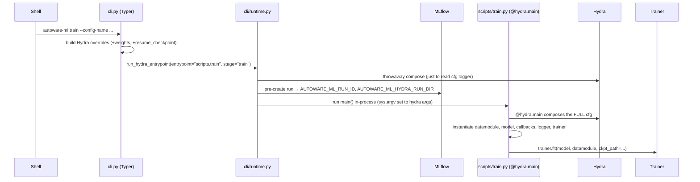

# 執行流程（Execution Flow）— 執行 `autoware-ml train` 時發生了什麼事

> 本文件追蹤一次訓練執行（run）的**控制流**：從你輸入的指令，一路到
> `trainer.fit()`。讀完這一篇之後，整個框架就不再感覺像是魔法了。
>
> 相關文件：[data_flow.md](data_flow.md) 追蹤的是*資料*流；
> [../code_walkthrough/entry_point.md](../code_walkthrough/entry_point.md) 則是把
> 同樣的故事放到最大倍率去看（每一個函式、每一個 `file:line`）。

---

## 為什麼會有「CLI 層」與獨立的「script 層」

一個天真的設計可能會讓 `autoware-ml train` 直接執行 Hydra。Autoware-ml
刻意把它拆成兩層：

- **`autoware_ml/cli/`** — 一個 **Typer** CLI。它必須啟動得*很快*（因為要支援
  shell 的 tab 自動補全），而且在 import 時不能載入 torch/Hydra/MLflow。它只負責
  解析參數，然後*延遲（lazily）*分派工作。
- **`autoware_ml/scripts/`** — 真正的 **`@hydra.main` 進入點**（`train.py`、
  `test.py`、`deploy.py`）。這裡才是真正做重活的地方。

兩者之間的橋接層 `autoware_ml/cli/runtime.py`，在真正的工作開始之前，
還做了一件聰明的事：它會**預先建立 MLflow run**，讓 run 目錄一開始就已確定，
使得 Hydra 的輸出目錄與 MLflow 的 artifact 目錄能夠對齊。

---

## 呼叫鏈（高層次視角）



---

## 逐步解析

### 1. Console script (主控台腳本)

`pyproject.toml` 宣告了進入點：

```toml
[project.scripts]
autoware-ml = "autoware_ml.cli.cli:main"
```

所以 `autoware-ml ...` 會呼叫 `autoware_ml/cli/cli.py:main()`，它只是單純
執行 Typer app（`app()`）。Typer 會依照第一個參數（`train`、`test`、`deploy`、
`mlflow`、`session`、`create-dataset`）路由到對應的指令函式。

> **實際的指令名稱：** `train`、`test`、`deploy`、`create-dataset`、`mlflow ui`、
> `mlflow export`、`session start|attach|detach|ls|stop`。**沒有 `predict`**
> 這個子指令，而且 dataset 產生的指令是 `create-dataset`（不是 `create-data`）。

### 2. `train` 子指令

`cli.py` 中的 `train()` 指令會做以下的事：

- 驗證 `--weights` 與 `--resume-checkpoint` **互斥**，
- 把它們轉換成 Hydra override：`+weights=[...]` 或 `+resume_checkpoint=...`，
- 把其餘所有參數轉發給 Hydra（所以 `trainer.max_epochs=100` 這種寫法「直接就能用」），
- 呼叫延遲分派器 `run_lazy_script(...)` → `cli/runtime.py` 中的
  `run_hydra_entrypoint`，並傳入 `entrypoint_module="autoware_ml.scripts.train"`
  與 `stage="train"`。

`run_lazy_script`（`utils/cli/helpers.py`）只有一行：
`importlib.import_module(module_path)`，接著 `getattr(module, fn)(...)`。
正是這一招讓 CLI 啟動時不需要載入 torch/Hydra。

### 3. `run_hydra_entrypoint` — 橋接層（`cli/runtime.py`）

有兩項職責：

1. **預先建立執行環境**（`prepare_runtime_environment`）：它會先做一次
   *用完即丟（throwaway）*的 Hydra compose，只是為了讀取 `cfg.logger`。
   如果有設定 logger，它就會在此時建立 MLflow run，並匯出 `AUTOWARE_ML_RUN_ID`
   與 `AUTOWARE_ML_HYDRA_RUN_DIR`。這就是為什麼 Hydra 的 job 目錄與 MLflow
   的 artifact 目錄會對齊——run 目錄是透過 `configs/defaults/modules/run.yaml`
   固定下來的，而它讀取的是 `${oc.env:AUTOWARE_ML_HYDRA_RUN_DIR,...}`。
2. **執行真正的進入點**：它會把 `sys.argv` 設定成 Hydra 的呼叫方式
   （`--config-name <name>` + overrides），然後呼叫
   `run_lazy_script("autoware_ml.scripts.train", "main")`。

### 4. `scripts/train.py:main` — 真正的 Hydra 進入點

```python
@hydra.main(version_base=None, config_path=_CONFIG_PATH)   # _CONFIG_PATH = autoware_ml/configs
def main(cfg: DictConfig):
    ...
```

**這個 decorator 就是 Hydra 為這次任務組合出完整 config 的地方。** 從這裡開始，
`cfg` 就是一個已完全解析好的 `DictConfig`。接下來 `main` 依序做（大約對應
`train.py:86–156`）：

```python
configure_torch_runtime(); set_seed(cfg)                          # TF32, seed_everything

datamodule = hydra.utils.instantiate(cfg.datamodule)              # :90  → a DataModule
model      = hydra.utils.instantiate(cfg.model)                   # :93  → a BaseModel
model.set_data_preprocessing(hydra.utils.instantiate(cfg.data_preprocessing))  # :94

# --weights → apply_matching_weights(model, ...);  --resume → validate ckpt   :96–114

callbacks     = instantiate_callbacks(cfg, ...)                   # ModelCheckpoint, EarlyStopping, LRMonitor
trainer_logger = hydra.utils.instantiate(cfg.logger)              # MLFlowLogger (if enabled)
trainer        = instantiate_trainer(cfg, callbacks, trainer_logger, root_dir)  # lightning.Trainer

trainer.fit(model, datamodule=datamodule, ckpt_path=resume_checkpoint_path)     # :156

return float(trainer.callback_metrics[cfg.optimized_metric])      # for Optuna sweeps
```

**唯一需要記住的一件事：** 每一個主要物件——`datamodule`、`model`、`logger`、
`trainer`，以及（透過 `instantiate_callbacks`/`instantiate_trainer`）callback
與 trainer——全部都是由 `hydra.utils.instantiate(cfg.<section>)` 產生的。
這裡的 Python 只是膠合程式碼；真正的*定義*都放在 YAML 裡。

### 5. `trainer.fit()` — 交給 Lightning 接手

從 `trainer.fit()` 開始，你就進入了 PyTorch Lightning 的內部。它會在迴圈中
呼叫你的模型從 `BaseModel` 繼承來的各個 hook：

```text
per batch:  on_after_batch_transfer  →  training_step  →  (backward, optimizer.step)
per epoch:  validation_step ×N  →  on_validation_epoch_end (metrics)  →  ModelCheckpoint
```

這些 hook 的細節請參閱 [../training/training_loop.md](../training/training_loop.md)
與 [../model/model_architecture.md](../model/model_architecture.md)。

---

## `test` 與 `deploy` 是同樣的形狀

它們重複使用*完全相同*的橋接層（`run_hydra_entrypoint`）與相同的實例化模式；
只有最後一個步驟不同：

| 指令 | 最後步驟 | 備註 |
| ------- | --------- | ----- |
| `train` | `trainer.fit(...)` | 可能會從完整的 checkpoint 恢復（resume） |
| `test`  | `trainer.test(...)` | 透過 `apply_matching_weights(set_eval=True)` 載入 `--weights`；預設在 1 個裝置上執行 |
| `deploy`| 依模組匯出 ONNX/TensorRT | 沒有 `fit`/`test`；載入權重、取一個 predict batch，然後匯出 |

因為這三者讀的都是**同一份 config**，「你訓練出來的東西」與「你部署的東西」
保證是同一套架構。

---

## 各項工作在哪裡執行（CPU vs GPU vs 子行程）

- **CLI 解析 + MLflow 預先建立** — CPU，主行程，速度快。
- **`@hydra.main` 組合 + 實例化** — CPU，主行程。
- **DataModule worker（transforms）** — CPU，在 `num_workers` 個子行程中執行。
- **`on_after_batch_transfer` + `forward` + loss + backward** — GPU。
- **DDP（多 GPU）** — 當 `devices>1` 且 `strategy=auto` 選擇了 DDP 時，Lightning
  會為每個 GPU 各自產生一個行程；單一 GPU 則留在主行程中執行（沒有子行程的額外開銷）。

---

## 常見除錯情境

| 症狀 | 原因 | 修正／從哪裡查 |
| ------- | ----- | ------------------- |
| 訓練開始前指令就卡住 | 用完即丟的 Hydra compose 靜默失敗，或 MLflow 的資料庫被鎖住 | 用同一份 config 搭配 `--cfg job` 執行，把解析後的 config 印出來 |
| 出現「Config composition」／`MissingMandatoryValue` 錯誤 | 某個 `???` 欄位沒有被填上，或 `defaults:` 項目有誤 | 該 task 的 `base.yaml` 與 leaf config |
| Override 沒有生效 | 對已存在的 key 使用了 `+key=`，或是 `_self_` 順序的問題 | [../code_walkthrough/config_flow.md](../code_walkthrough/config_flow.md) |
| Run 目錄／MLflow 目錄對不上 | `AUTOWARE_ML_HYDRA_RUN_DIR` 沒有被遵守 | `configs/defaults/modules/run.yaml`、`cli/runtime.py` |
| 多 GPU 啟動不了 | `strategy`/`devices` 不匹配 | `trainer.devices=[0,1]`，參見 `docs/user-guide/training.md` |
| 想看實際使用的 config | — | `autoware-ml train --config-name ... --cfg job`（只印出不執行） |

---

## 常見修改情境

| 我想要… | 這樣做 |
| ---------- | ------- |
| 為 `train` 新增一個 CLI flag | 編輯 `cli/cli.py` 中的 `train()` 指令，把它轉換成 Hydra override，再到 `scripts/train.py` 中讀取 |
| 更改 `fit` 之後要執行的內容 | 編輯 `scripts/train.py`（例如自動接著執行 `test`） |
| 新增一個子指令 | 在 `cli/cli.py` 中新增一個 Typer 指令 + 一個 `scripts/<name>.py` 進入點 |
| 更改預設的 run／artifact 版面配置 | `configs/defaults/modules/run.yaml` + `utils/mlflow_helpers.py` |

---

**下一步：** [data_flow.md](data_flow.md) — 現在換個角度，追蹤*資料*如何流經這同一套機制。
