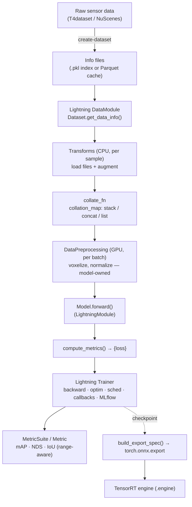

# 框架總覽 (Framework Overview)

> **請先閱讀這一篇。** 這篇文件會給你整體的世界觀（框架為什麼存在、為什麼長成這個樣子）
> 以及一份 repository 地圖。後續文件會再針對各個領域深入探討。

---

## 1. Autoware-ML 要解決什麼問題？

[Autoware](https://autoware.org/) 是一套開源的自動駕駛技術堆疊。它需要
**感知模型（perception model）** — 3D 物件偵測器、LiDAR 語意分割模型、以相機為輸入的
分類器 — 這些模型必須**透過 TensorRT，在車輛的 NVIDIA GPU 上**即時運作。

產出這樣的模型需要經過一條很長的鏈路：

```text
raw sensor logs → annotated dataset → training → evaluation → ONNX → TensorRT engine
```

如果沒有框架，會出現三個問題：

1. **每個模型都重新發明一次整條鏈路。** 資料載入、訓練迴圈、checkpoint、
   metrics、匯出流程，每個模型都要重新寫一次，而且每次都有些微不同。
2. **訓練與部署漸行漸遠。** 匯出的模型會與訓練出來的模型不再一致，因為匯出流程
   放在另一支沒有人維護更新的獨立腳本裡。
3. **實驗無法重現。**「是哪一份 config 產生了這個 checkpoint？」會變成一個
   無法回答的問題。

**Autoware-ML 的答案：** 建立一個單一框架，讓**每個模型 — 無論其內部架構為何 —
都流經同一套契約（contract）**，從 dataset 一路到 TensorRT。你只需要實作一個小小的
介面就能新增模型；框架則負責訓練迴圈、分散式訓練、記錄（logging）、checkpoint、
評估（evaluation）與匯出。

> Autoware-ML 是 **`tier4/AWML`（舊有、以 MMDetection3D 為基礎的 repo，見
> `README.md`）的全新繼任者**，從頭打造而成。它鎖定同樣的目標 — 為 Autoware
> 部署感知模型 — 但採用更乾淨、更現代化的架構。

---

## 2. 為什麼是*這樣的*設計？（以及它與你原本熟悉的方式有何不同）

這是最重要的一節。如果你跳過這一節，之後看每一支檔案都會覺得莫名其妙。

### 技術堆疊

Autoware-ML 建立在四個承重（load-bearing）的函式庫之上（見 `pyproject.toml`）：

| 函式庫 | 角色 | 取代了「純 PyTorch」的什麼 |
| ------- | ---- | -------------------------------------- |
| **PyTorch Lightning** (`lightning==2.6.1`) | 訓練迴圈、DDP、precision、checkpoint、hooks | 手寫的 `for epoch in ...` 迴圈 |
| **Hydra** (`hydra-core==1.3.2`) | Config 組合 + 物件實例化 | argparse + 手動的 `Model(...)` 建構 |
| **MLflow** (`mlflow==3.10.1`) | 實驗追蹤（params、metrics、artifacts） | print 陳述式／TensorBoard 拼湊出的整合 |
| **Pydantic + jaxtyping** | 具型別的 dataset schema + 具型別的 tensor shape | 沒有型別的 dict，以及難以察覺的 shape bug |

此外還有 **Optuna**（透過 `hydra-optuna-sweeper` 進行超參數搜尋）、**pixi**
（環境管理），以及 **zensical**（你現在可能正在閱讀的文件網站）。

### 兩個你必須先吸收的核心概念

**(a) 沒有 registry。`_target_` 就是一個 Python import 路徑。**

在 MMDetection3D／OpenMMLab／舊版 AWML 中，你會用一個 decorator 來註冊一個類別，
然後用字串 `type` 來參照它：

```python
@MODELS.register_module()          # OLD (MMDet3D / AWML)
class CenterHead(nn.Module): ...
# config:  dict(type='CenterHead', ...)
```

在 Autoware-ML 中，**沒有 decorator，也沒有 registry**。config 會用類別的
**完整點號分隔（dotted）import 路徑**來指名，然後由 Hydra 去 import 並呼叫它：

```yaml
# NEW (Autoware-ML)
bbox_head:
  _target_: autoware_ml.models.detection3d.heads.centerpoint.CenterHead
  # ...constructor kwargs...
```

`hydra.utils.instantiate(cfg.bbox_head)` 實際上做的事情就等同於
`from autoware_ml.models.detection3d.heads.centerpoint import CenterHead; CenterHead(**kwargs)`。

你會感受到的後果是：

- **`__init__.py` 檔案被刻意保持為空**（不做 re-export）。`_target_` 與 import
  都直接指向*實作所在的模組*。不要「好心」地去加上 re-export。
- **要找某個元件，就直接讀 `_target_` 字串** — 它本身就是檔案路徑，不需要 grep
  尋找註冊用的 decorator。
- **大多數錯誤都是 import／instantiation 錯誤。** `_target_` 打錯字會在建構期
  就失敗，並顯示清楚的「無法 import」訊息。

**(b) 模型活在套件*內部*，而不是獨立的 `projects/` 目錄樹裡。**

舊版 AWML 把每個模型放在 `projects/<Model>/` 底下。Autoware-ML 則把它們放在
`autoware_ml/models/` 裡。**沒有 `projects/` 目錄**。一個「模型」就只是
`BaseModel` 的子類別加上一份 config，它並不會擁有自己專屬的頂層資料夾。

### 並排比較速查表

| 面向 | 純 PyTorch | MMDet3D / AWML (old) | **Autoware-ML** |
| ------- | ------------- | -------------------- | --------------- |
| 訓練迴圈 | 手寫 | MMEngine `Runner` | **Lightning `Trainer`** |
| 元件組裝 | 手動建構 | Registry + 字串 `type=` | **Hydra `_target_` = import 路徑** |
| Config 格式 | argparse/dict | MMEngine `Config`（`.py`、`_base_`） | **Hydra YAML**（`defaults:`、`${...}`） |
| 模型位置 | 任意位置 | `projects/<Model>/` | **`autoware_ml/models/`** |
| 基底類別 | `nn.Module` | `BaseModel`/`Base3DDetector`（MM） | **`BaseModel(LightningModule)`** |
| Metrics | 自行撰寫 | MM `Metric` + evaluator | **`MetricSuite`（torchmetrics）** |
| 追蹤（Tracking） | 手動 | hooks | **MLflow（內建）** |
| 匯出 | 獨立 repo／腳本 | `mmdeploy` | **模型內的 `build_export_spec()`** |

---

## 3. 端到端 pipeline



| 階段 | 職責 | 位於何處 |
| ----- | -------------- | -------------- |
| **create-dataset** | 把原始標註資料轉換成快速、可索引的 info 檔 | `autoware_ml/tools/dataset/`、`databases/` |
| **DataModule / Dataset** | 決定*哪些* sample 存在；回傳原始的中繼資料 dict | `autoware_ml/datamodule/` |
| **Transforms** | 實際*載入*點雲／影像並對其進行*增強（augment）*（CPU，逐 sample） | `autoware_ml/transforms/` |
| **collate_fn** | 依照每個 key 的策略，把多個 sample 合併成一個 batch | `autoware_ml/datamodule/base.py` |
| **DataPreprocessing** | GPU、逐 batch 的步驟，由*模型自行擁有*（例如 voxelization） | `autoware_ml/preprocessing/` |
| **Model** | `forward()` + `compute_metrics()`；其餘皆繼承自 `BaseModel` | `autoware_ml/models/` |
| **Trainer** | 你永遠不需要自己寫的迴圈：backward、optim、DDP、precision、checkpoint | Lightning + `autoware_ml/callbacks/` |
| **Metrics** | 在一個 epoch 中累積、跨 GPU 做 reduce、依距離區間回報 | `autoware_ml/metrics/` |
| **Export** | 模型宣告*要匯出什麼*；框架負責 ONNX → TensorRT | `autoware_ml/utils/deploy.py`、`ops/` |

顏色的直覺（來自 `docs/framework/design.md`）：CPU 端涵蓋一直到並包括
`collate_fn` 的所有內容；GPU 端則從 `DataPreprocessing` 開始，一路延續到
`forward`、loss 與 backward。

---

## 4. 工程師的工作流程

```bash
# 0. Enter the environment (Docker image, or local pixi)
./docker/container.sh --run                 # or: pixi shell --environment default

# 1. Build info files from a dataset
autoware-ml create-dataset --dataset nuscenes --task detection3d \
    --root-path data/nuscenes --out-dir data/nuscenes/info --version v1.0-trainval

# 2. Train. --config-name is the path under configs/tasks/ minus the .yaml
autoware-ml train --config-name detection3d/centerpoint/voxel020_second_secfpn_51m_nuscenes

# 3. Watch it (params / metrics / artifacts)
autoware-ml mlflow ui --port 5000

# 4. Evaluate a checkpoint (same config!)
autoware-ml test --config-name <same> \
    --weights mlruns/<task>/<model>/<config>/<run_id>/artifacts/checkpoints/best.ckpt

# 5. Export to ONNX (+ TensorRT)
autoware-ml deploy --config-name <same> \
    --weights mlruns/<task>/<model>/<config>/<run_id>/artifacts/checkpoints/best.ckpt
```

有兩個概念讓整套流程保持一致：

- **一個 `--config-name` = 一個 `(task, model, variant, dataset)` 的組合。**
  *同一份* config 同時驅動 train、test 與 deploy — 訓練出來的產物與匯出的產物
  不可能彼此不一致，因為它們讀的是同一份描述。
- **任何設定都只差一個 Hydra override。** 例如 `trainer.max_epochs=100`、
  `model.optimizer.lr=1e-4`、`trainer.precision=16-mixed`，或用 `--multirun`
  進行參數掃描（sweep）。你幾乎不需要為了跑一次實驗而去修改 YAML。

---

## 5. Repository 地圖

有兩個層級值得關注：**repo 根目錄**（專案基礎設施）與 **`autoware_ml/` 套件**
（框架本身）。

### 5.1 Repo 根目錄

| 路徑 | 用途 | 如果你變更它… |
| ---- | ------- | ----------------- |
| `autoware_ml/` | **框架套件本身。** 一切可以被 import 的東西都在這裡。 | 見 5.2 — 真正的工作都在這裡進行 |
| `docs/` | `zensical` 文件網站（本指南就位於 `docs/onboarding/`） | 只影響文件 |
| `docker/` | `container.sh` + Dockerfile；官方支援的執行環境 | 影響每個人執行程式碼的方式 |
| `ansible/` | 主機／機器的環境部署（provisioning） | 僅影響維運 |
| `pyproject.toml` | 相依套件、`autoware-ml` console script、pixi 環境、ruff | 會改變整個環境；需要重新安裝 |
| `pixi.lock` | 固定版本的相依套件鎖定檔 | 影響可重現性；需謹慎重新產生 |
| `set_data_path.sh` | 設定 `AUTOWARE_ML_DATA_PATH`（dataset 根目錄） | 決定去哪裡找 dataset |
| `mlruns/` | MLflow 儲存區（runs、checkpoint、artifacts）— 自動產生 | 你的實驗歷史紀錄 |
| `work_dirs/`、`data/` | 產生的輸出／資料集 — gitignore 排除 | 僅供本機使用 |

### 5.2 `autoware_ml/` 套件

依角色分組。**相依方向（direction of dependency）**很重要：configs 與 CLI
位於最上層；models／datamodule／transforms 在中間層；ops／geometry／utils
則是最底層的基礎。

**編排（Orchestration，最上層 — 一次執行如何被驅動）**

| 子套件 | 用途 | 主要內容 | 變更影響 |
| ---------- | ------- | ------------ | ------------- |
| `cli/` | `autoware-ml` 這個 Typer CLI + Hydra 進入點的橋接層 | `cli.py`（各項指令）、`runtime.py`（`run_hydra_entrypoint`） | 每個指令的行為 |
| `scripts/` | 真正的 `@hydra.main` 進入點 | `train.py`、`test.py`、`deploy.py`、`create_dataset.py`、`session.py` | 每個指令實際*做*的事 |
| `configs/` | **所有的 Hydra YAML。** 選擇並串接每一個元件 | `defaults/`、`tasks/`、`datasets/`、`datamodule/`、`database/` | 每一次執行的組成 |
| `utils/` | 共用的執行期膠合程式碼 | `runtime.py`（trainer/callback/logger 建構器）、`optimizer.py`、`mlflow_helpers.py`、`deploy.py`、`checkpoints.py`、`schedulers/` | 橫跨多處；影響範圍廣 |

**模型（被訓練的對象）**

| 子套件 | 用途 | 主要內容 | 變更影響 |
| ---------- | ------- | ------------ | ------------- |
| `models/` | 模型類別（全部都是 `BaseModel` 的子類別） | `base.py`（**`BaseModel`**）、`detection3d/`、`segmentation3d/`、`calibration_status/`、`multi/`、`common/` | 單一模型，或（透過 `base.py`）*所有*模型 |
| `losses/` | Loss 函式，由各個 head 所擁有 | `detection3d/`、`detection2d/`、`segmentation3d/` | 使用它們的模型的 loss |

**資料（餵給模型的東西）**

| 子套件 | 用途 | 主要內容 | 變更影響 |
| ---------- | ------- | ------------ | ------------- |
| `datamodule/` | Lightning 的 `DataModule`/`Dataset` + collation | `base.py`（**`DataModule`、`Dataset`、`collate_fn`**）、`t4dataset/`、`nuscenes/`、`multi_task/`、`splitters/` | 資料如何被載入與組成 batch |
| `transforms/` | CPU 端逐 sample 的載入與增強 | `base.py`（**`BaseTransform`、`TransformsCompose`**）、`point_cloud/`、`camera/`、`boxes3d/`、`camera_lidar/`、… | 使用它們的模型的資料處理流程 |
| `preprocessing/` | GPU、逐 batch、由模型擁有的前處理 | `base.py`（**`DataPreprocessing`**）、`detection3d/point_pillar.py` | 面向模型的 batch 形塑 |
| `databases/` | 離線 dataset 解析 → 經驗證的 Parquet 快取 | `t4dataset/`、`schemas/`（Pydantic）、`box3d_pipelines/` | Dataset info 產生流程 |

**評估與基礎（支援層）**

| 子套件 | 用途 | 主要內容 | 變更影響 |
| ---------- | ------- | ------------ | ------------- |
| `metrics/` | Epoch 層級的評估 | `base.py`（**`MetricSuite`、`Metric`**）、`eval_mixin.py`、`detection3d/`、`segmentation3d/` | 模型如何被評分 |
| `callbacks/` | 自訂的 Lightning callback | `early_stopping.py`（以 config 為準） | 訓練迴圈的行為 |
| `ops/` | 自訂的 CUDA/Python op + ONNX/TRT 橋接 | `bev_pool/`（CUDA）、`spconv/`、`voxelization/`、`segment/`、`indexing/` | 使用它們的模型的效能與匯出 |
| `geometry/` | Box／point 幾何計算 | `bbox_3d/`、`points/` | transforms／head 的正確性 |
| `types/` | 共用的型別別名（jaxtyping） | tensor/shape 型別 | 僅影響型別檢查 |
| `tools/` | Dataset 產生執行器 | `dataset/runner.py` | `create-dataset` 的行為 |
| `tests/` | 對應套件結構的 Pytest 測試套件 | `tests/<subpackage>/` | 你的安全網 — 請執行它 |

### 關於這份地圖，唯一要記住的一條規則

> **這個框架的「大腦」是三支檔案：** `models/base.py`（`BaseModel`）、
> `datamodule/base.py`（`DataModule`/`Dataset`/collation），以及 `configs/`
> （把它們串接起來的 YAML）。搞懂這三者，其餘的都只是細節。

---

## 常見除錯情境（框架層級）

| 症狀 | 可能原因 | 從哪裡查 |
| ------- | ------------ | ------------- |
| 啟動時出現 `Cannot instantiate / import` | `_target_` 路徑錯誤，或類別被改名 | YAML 中的 `_target_`；實際的模組路徑 |
| `forward` 內對某個 batch key 出現 `KeyError` | `collation_map` 把該 key 丟掉了（它是嚴格的白名單） | config 中的 `datamodule.collation_map`；[data_flow.md](data_flow.md) |
| Config 值沒有生效 | 被 `_self_` 順序或某個 leaf config 覆蓋；或需要用 `+` 來*新增* | [../code_walkthrough/config_flow.md](../code_walkthrough/config_flow.md) |
| `MissingMandatoryValue`（`???`） | base config 把某欄位留為必填，但 leaf 沒有補上 | 該 task 的 `base.yaml`；在 leaf 中補上 |
| 模型能訓練，但匯出失敗 | 該 op 沒有對應的 ONNX symbolic，或模型需要覆寫 `build_export_spec` | [../deployment/export_pipeline.md](../deployment/export_pipeline.md) |
| Docker 內抓不到 GPU（`Failed to initialize NVML`） | NVIDIA Container Toolkit／cgroup 的問題，與模型無關 | `docs/framework/troubleshooting.md` |

---

## 常見修改情境（以及該從哪裡下手）

| 我想要… | 從這裡開始 |
| ---------- | -------- |
| 新增一個全新的模型 | [../model/model_architecture.md](../model/model_architecture.md) + `docs/contributing/adding-models.md` |
| 新增一個 dataset | [../dataset/dataset_pipeline.md](../dataset/dataset_pipeline.md) |
| 新增／調整一個 augmentation | [../dataset/augmentation.md](../dataset/augmentation.md) |
| 更換 optimizer 或排程（schedule） | [../training/optimizer_scheduler.md](../training/optimizer_scheduler.md) |
| 新增或調整一個 metric | [../evaluation/metrics.md](../evaluation/metrics.md) |
| 匯出成 ONNX/TensorRT | [../deployment/export_pipeline.md](../deployment/export_pipeline.md) |
| 從外而內理解一次執行（run） | [execution_flow.md](execution_flow.md) |

---

**下一步：** [data_flow.md](data_flow.md) — 追蹤單一 sample 從硬碟到 loss 值的完整旅程。
