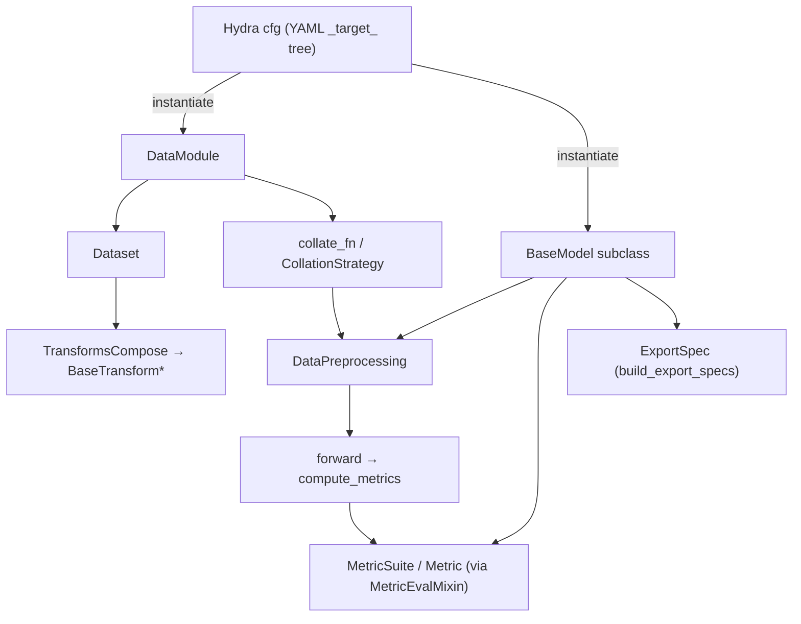

# 程式碼逐步解析 — 重要類別 (Important Classes)

> 這是一張參考卡，列出你最常接觸的約 10 個 class。閱讀程式碼時請保持開啟。每個條目都會
> 說明：它位於哪裡、為什麼存在、關鍵方法，以及需要注意的坑（gotcha）。更深入的內容則依
> 領域連結到對應文件。

整個框架的契約（contract）都建立在**三個 base class** 之上，再加上少數幾個輔助型別：

```text
BaseModel        (models/base.py)          ← every model IS a LightningModule
DataModule       (datamodule/base.py)      ← owns dataloaders + collation
Dataset          (datamodule/base.py)      ← returns metadata; transforms do the loading
+ BaseTransform / TransformsCompose        ← CPU augmentation
+ DataPreprocessing                        ← GPU per-batch shaping
+ MetricSuite / Metric / MetricEvalMixin   ← epoch evaluation
+ ExportSpec                               ← deployment contract
```

---

## `BaseModel` — `autoware_ml/models/base.py:42`

```python
class BaseModel(MetricEvalMixin, L.LightningModule, ABC):
```

**為什麼存在：** 讓每個模型都共用同一套 training/val/test/predict 路徑、同一套 optimizer
設定、同一套 metric 記錄機制，以及同一份 export 契約 — 讓模型作者只需要撰寫 network 與 loss
就好。

**你必須實作（abstract）：**

| Method | 契約 |
| ------ | -------- |
| `forward(self, **kwargs)`（`:188`） | 簽章可任意設計。base 只會傳入名稱與你的參數相符的 batch 鍵。 |
| `compute_metrics(self, batch, outputs)`（`:204`） | 回傳的 dict **必須**包含 `"loss"`。會收到*完整*的 batch 加上 forward 的輸出。 |

**你會繼承的部分（除非特別註明，否則不要覆寫）：**

| Method／attr | 作用 | 行號 |
| ------------- | ------------ | ---- |
| `__init__(optimizer, scheduler, optimizer_group_overrides, scheduler_config, metrics)` | 儲存 optimizer／scheduler 的**partial**；建立 `forward_signature`；設定空的 `DataPreprocessing`。 | `:50` |
| `self.forward_signature = inspect.signature(self.forward)` | 在建構時**只擷取一次**；用來驅動 batch 鍵的過濾。 | `:71` |
| `_shared_step(batch, prefix, **kw)` | 把 batch 過濾成 `forward` 的 kwargs，執行 forward，呼叫 `compute_metrics`，斷言 `"loss"` 存在，並記錄 log。 | `:239` |
| `training_step` / `validation_step` / `test_step` / `predict_step` | `@final` — 你不能覆寫它們。train 會回傳 `loss`；val/test 還會額外回傳 `{"model_outputs": ...}` 供 metrics 使用。 | `:270`–`:356` |
| `on_after_batch_transfer(batch, idx)` | 在裝置上（on-device）、逐 batch 執行模型所擁有的 `DataPreprocessing`。 | `:94` |
| `set_data_preprocessing(dp)` | 安裝前處理 pipeline（由 entrypoint 呼叫）。 | `:80` |
| `predict_outputs(batch, outputs)` | 預設會原封不動回傳 outputs；如需在預測時做格式化，可覆寫此方法。 | `:109` |
| `get_log_batch_size(batch)` | 供記錄用的樣本數；若是不規則（ragged）的點雲，可覆寫此方法。 | `:219` |
| `build_export_specs(batch)` / `build_export_spec(batch)` | 部署用：預設會把整個模型包成單一個 `end_to_end` ONNX module；若需要拆分匯出，可覆寫此方法。 | `:380` / `:358` |
| `configure_optimizers()` | 透過 `build_lightning_optimizer_config`，從 partial 建構出 optimizer 與 scheduler。 | `:395` |

**簽章檢查（signature-inspection）的技巧（每個人都會被這招嚇到）：**

```python
# _shared_step, base.py:253
forward_inputs = {k: batch[k] for k in self.forward_signature.parameters if k in batch}
outputs = self(**forward_inputs)
```

只有名稱與 `forward` 的參數*名稱*相符的 batch 鍵才會被傳入。所以 `forward(self, voxels,
num_points, voxel_coords)` 只會收到這三個；`gt_boxes`／`gt_labels` 不會傳給 `forward`，但
`compute_metrics` 仍然可以取得它們。**結果：** 你的 `forward` 參數名稱其實就是一個
API — 它們必須與（前處理後的）batch 鍵一致。

**注意事項（Gotchas）：**
- `compute_metrics` 必須回傳 `"loss"`，否則 `_shared_step` 會拋出例外（`:260`）。
- 這些 step 方法都是 `@final`；要擴充行為請透過 hook，而不是覆寫 step。
- Optimizer／scheduler 是以可呼叫物件（partial）的形式抵達，而不是實例 — 詳見下文。

深入閱讀：[../model/model_architecture.md](../model/model_architecture.md)。

---

## `Dataset` — `autoware_ml/datamodule/base.py:76`

```python
class Dataset(TorchDataset, ABC):
    def __getitem__(self, index):                       # :93
        input_dict = self.get_data_info(index)
        context = PipelineContext(dataset=self, index=index)
        return self.apply_transforms(input_dict, self.dataset_transforms, context)

    @abstractmethod
    def get_data_info(self, index) -> dict: ...          # :106  YOU implement this
```

**為什麼存在：** 用來把「哪些樣本存在＋它們的 metadata」（dataset 的工作）與「載入檔案＋做
增強（augment）」（transform 的工作）分開。

**契約：** `get_data_info` 回傳的是一個**單純的 metadata dict**（路徑、原始 annotation、
校正資訊）— **不是 tensor，也不是已經載入的檔案。** 載入這件事發生在 transform 裡。這讓
dataset 保持精簡，也讓載入過程可組合／可設定。

深入閱讀：[../dataset/dataset_pipeline.md](../dataset/dataset_pipeline.md)。

---

## `DataModule` — `autoware_ml/datamodule/base.py:139`

```python
class DataModule(L.LightningDataModule, ABC):
    def __init__(self, collation_map=None,
                 train_transforms=None, val_transforms=None, test_transforms=None, predict_transforms=None,
                 train_dataloader_cfg=None, val_dataloader_cfg=None, test_dataloader_cfg=None, predict_dataloader_cfg=None): ...

    @abstractmethod
    def _create_dataset(self, split, dataset_transforms=None) -> Dataset: ...   # :249  YOU implement
```

**為什麼存在：** 有一個地方統一擁有每個 split 的 transform、每個 split 的 dataloader
設定，以及 collation 策略 — 這樣一個新的 dataset 只需要實作 `_create_dataset` 就好。

**關鍵方法：**

| Method | 角色 | 行號 |
| ------ | ---- | ---- |
| `setup(stage)` | 把 `fit`→`[train,val]`、`test`→`[test]`……等對應起來，並透過 `_create_dataset` 建構每個 split 的 dataset。 | `:268` |
| `_create_dataloader(split)` | 把該 split 的 dataset 包進 `DataLoader(collate_fn=self.collate_fn, **cfg)`。 | `:298` |
| `train/val/test/predict_dataloader()` | 薄薄的委派，直接呼叫 `_create_dataloader`。 | `:311`–`:325` |
| `collate_fn(batch)` | batching 引擎，由 `collation_map` 驅動。 | `:423` |

**`DataLoaderConfig`**（`:40`）是一個 dataclass（`batch_size`、`num_workers`、`pin_memory`、
`persistent_workers`、`shuffle`、`drop_last`）；`_coerce_dataloader_cfg` 會在 Hydra 的邊界
上，把 dict／`DictConfig`／dataclass 統一正規化。

深入閱讀：[../dataset/dataset_pipeline.md](../dataset/dataset_pipeline.md)。

---

## `collate_fn` + `CollationStrategy` — `datamodule/base.py:423`, `datamodule/collation.py`

`collation_map` 是一份**嚴格的白名單（whitelist）**：只有列在其中的鍵才會進到 batch；沒有
列出的鍵會被丟棄；有列出但缺漏的鍵則會警告並跳過（在 predict／deploy 時是預期行為）。

| 策略 | 行為 | 備註 |
| -------- | -------- | ---- |
| `stack`（`:468`） | `torch.stack`；所有的 shape 都必須相符 | shape 不符時會拋出 `ValueError` |
| `concat`（`:470`） | `torch.cat(dim=0)`；**第一個** concat 鍵會設定 `batch["offset"]`（累積長度） | 適用於長度不固定的點雲 |
| `index_concat`（`:476`） | concat 再加上依主要空間的 exclusive offset 平移索引 | 需要有一個 `concat` 鍵存在 |
| `list`（`:478`） | 以 Python list 保留，逐樣本 | CenterPoint 對 `points`/`gt_boxes`/`gt_labels` 使用這個策略 |

`"offset"` 是一個**保留（reserved）**鍵 — 在 `collation_map` 中宣告它會拋出例外
（`:200`）。`_coerce_value`（`:327`）會把 numpy 轉成 tensor，但會保留 numpy 純量（scalar）
的 dtype（所以 float64 的 timestamp 不會被量化）。

深入閱讀：[../architecture/data_flow.md](../architecture/data_flow.md)。

---

## `BaseTransform` / `TransformsCompose` — `autoware_ml/transforms/base.py`

**為什麼：** 可組合、逐樣本、CPU 端的載入＋增強，並具備統一的**dict-in／dict-out**契約。

```python
class BaseTransform(ABC):
    p = None                       # application probability (None = always)
    _required_keys = ()            # KeyError if absent
    def __call__(self, input_dict, context=None):
        # validate required keys → apply optional-key defaults → probability gate → transform()
        ...
    @abstractmethod
    def transform(self, input_dict) -> dict: ...     # returns updates to MERGE

class TransformsCompose:
    def __call__(self, input_dict, context=None):
        for t in self.pipeline:
            input_dict |= t(input_dict, context=context)   # merge each transform's output
        return input_dict
```

**注意事項（Gotchas）：**
- 一個 transform*只*會回傳它變更過的鍵；composer 會用 `|=` 進行合併。
- 幾何相關的 transform 必須同時對 `points` **與** `gt_boxes` 做轉換，否則 box 會偏移
  （drift）。
- `_target_` 要指向實作所在的具體 module（不透過 `__init__` re-export）。
- 目前有效的 `PipelineContext` 可以透過 `self.context` 取得（用於混合式增強）。

深入閱讀：[../dataset/augmentation.md](../dataset/augmentation.md)。

---

## `DataPreprocessing` — `autoware_ml/preprocessing/base.py`

```python
class DataPreprocessing:
    def __init__(self, pipeline=()): self.pipeline = list(pipeline)
    def __call__(self, batch):                    # runs on the GPU, per batch
        for layer in self.pipeline:
            batch |= layer(batch)
        return batch
```

**為什麼要跟 transform 分開：** transform 是在 CPU（worker 中）逐樣本執行；而這個則是在
GPU 上逐 batch 執行，並且是**由模型擁有**（透過 `set_data_preprocessing` 安裝，在
`BaseModel.on_after_batch_transfer` 中執行）。像 voxelization 這種重量級、模型專屬的操作
就放在這裡（例如 `PointPillarPreprocessor` 會加上 `voxels`、`num_points`、
`voxel_coords`）。

深入閱讀：[../dataset/dataset_pipeline.md](../dataset/dataset_pipeline.md)。

---

## `MetricSuite` / `Metric` / `MetricEvalMixin` — `autoware_ml/metrics/`

**為什麼：** epoch 層級的評估（mAP、NDS、IoU）需要在多個 GPU 之間正確地做 reduce，並依
距離範圍分別回報 — 與 loss 解耦。

| 型別 | 角色 | 位置 |
| ---- | ---- | -------- |
| `MetricSuite(torchmetrics.Metric)` | 狀態引擎：累積每個 batch 的狀態，跨 GPU 同步，並依 range 分派。 | `metrics/base.py` |
| `Metric` | 一個小型、可注入的策略（`MeanAP`、`Nds`、`IoU`……），讀取 suite 的狀態，並宣告自己的 `stages`。 | `metrics/base.py` |
| `MetricEvalMixin` | 被混入（mix）到 `BaseModel` 中；透過 Lightning hook 驅動 reset/update/compute 的生命週期。 | `metrics/eval_mixin.py` |

**模型需要提供的內容：** 一個方法，`build_eval_output(batch, outputs)`，把原始的 forward
輸出對應成 suite 會讀取的扁平 dict（例如 `{predictions, gt_boxes, gt_labels}`）。模型本身
從不呼叫 `update`／`compute`。鍵會以 `{split}/{prefix}/{key}` 的格式記錄，例如
`val/det3d/mAP`。

深入閱讀：[../evaluation/evaluation_pipeline.md](../evaluation/evaluation_pipeline.md)。

---

## `ExportSpec` — `autoware_ml/utils/deploy.py`

模型從 `build_export_specs` 回傳的部署契約：

```python
@dataclass(frozen=True)
class ExportSpec:
    module: torch.nn.Module                 # the exact submodule/wrapper to export
    args: tuple[Any, ...]                   # example inputs
    input_param_names: list[str]
    output_names: list[str] | None
    dynamic_axes: dict | None               # legacy path (dynamo=False)
    supported_stages: frozenset[str] = frozenset({"onnx", "tensorrt"})
```

預設情況下，整個模型會是單一個 `end_to_end` module。像 CenterPoint／BEVFusion 這類模型則
會覆寫 `build_export_specs`，以產出**多個**module（例如把 voxel-encoder 與
backbone-neck-head 分開匯出）。PTv3 則設定 `supported_stages = {"onnx"}`（不支援
TensorRT）。

深入閱讀：[../deployment/export_pipeline.md](../deployment/export_pipeline.md)。

---

## 它們如何連接（一張圖）



---

## 快速對照表：「我該把 X 放在哪裡？」

| 我想要變更…… | Class | 檔案 |
| ----------------- | ----- | ---- |
| 網路架構／loss | 你的 `BaseModel` 子類別 | `models/<task>/<model>.py` |
| 哪些樣本存在／它們的 metadata | `Dataset` 子類別 | `datamodule/<dataset>/<task>.py` |
| 每個 split 的 batch size／workers／transform | `DataModule` 子類別 + config | `datamodule/...` + leaf YAML |
| 鍵如何被 batch | `collation_map` | leaf/base YAML |
| GPU 上逐 batch 的整形（voxelization） | `DataPreprocessing` layer | `preprocessing/...` + `cfg.data_preprocessing` |
| CPU 端的增強（augmentation） | `BaseTransform` 子類別 | `transforms/...` |
| 一個 metric | `Metric` 子類別 + suite config | `metrics/...` + dataset YAML |
| 要匯出什麼／如何匯出 | 覆寫 `build_export_specs` | 你的模型 class |

---

**Phase 1 完成。** 你現在已經理解了這個框架的整體樣貌、它的執行流程、資料流，以及關鍵的
class。接下來可以繼續深入閱讀：
[../dataset/](../dataset/dataset_pipeline.md) · [../model/](../model/model_architecture.md) · [../training/](../training/training_loop.md) ·
[../evaluation/](../evaluation/evaluation_pipeline.md) · [../deployment/](../deployment/export_pipeline.md)。
