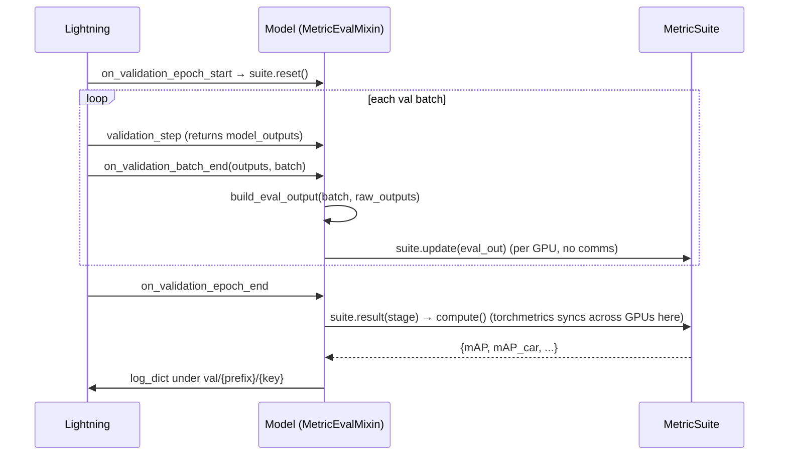

# 評估流程 (Evaluation Pipeline)

> **本文涵蓋內容：** validation/test 如何將模型的預測結果轉換為 epoch 層級的指標（metrics） —
> `MetricSuite`/`Metric` 的角色劃分、`MetricEvalMixin` 的生命週期，以及為何它與損失是分開的機制。
> 具體的指標（mAP、NDS、IoU）請見 [metrics.md](metrics.md)。
>
> 先備知識：[../model/model_architecture.md](../model/model_architecture.md)、
> [../training/training_loop.md](../training/training_loop.md)。

---

## 1. 損失（Loss）與指標（Metric）— 兩種不同的機制

| | Loss | Metric |
| --- | --- | --- |
| 計算時機 | 每個 step（train/val/test） | epoch 結束時（僅限 val/test） |
| 擁有者 | 模型/head（`compute_metrics`） | 附加於模型上的 `MetricSuite` 物件 |
| 粒度 | 每個 batch，純量 | 累積整個 epoch |
| 跨 GPU | Lightning 平均這個純量（`sync_dist`） | torchmetrics 依 state 逐一歸約，最後統一計算 |
| 目的 | 優化 | 回報品質（mAP、NDS、IoU） |

指標**不會**在 `validation_step` 中執行。它們是由 `MetricEvalMixin`（混入（mixed into）
`BaseModel`）透過 Lightning 的 epoch/batch hooks 來驅動的。哪些指標會在哪個 split 中執行，
完全是**純粹的 config** 設定。



---

## 2. 雙角色設計（`metrics/base.py`）

框架將評估拆分為一個**狀態引擎（state-engine）**與多個**策略（strategies）**：

- **`MetricSuite(torchmetrics.Metric)`** — 擁有累積的 state 及其跨 GPU 的歸約邏輯
  （`add_state`），以及按範圍（per-range）分派的邏輯。它*不會*決定要計算哪些數值。它實作了兩個
  抽象方法：`update(eval_out)`（將一個 batch 併入 state）與 `state_for(range)`（建構供指標讀取
  的 state 物件，可以是整體或依距離範圍區分）。
- **`Metric`** — 一個小型、無狀態（stateless）、可注入的策略。它實作 `evaluate(state,
  stage)` 並宣告自己的 `stages`。它會讀取 suite 的 state，並回傳報告中屬於它的那一部分。

```python
class Metric(ABC, Generic[StateT]):
    def __init__(self, stages=("val", "test")):
        self.stages = frozenset(EvalStage(s) for s in stages)   # when this metric runs
    @abstractmethod
    def evaluate(self, state, stage) -> dict[str, float]: ...

class MetricSuite(torchmetrics.Metric, ABC, Generic[StateT]):
    prefix: str = ""
    _required_keys: tuple[str, ...] = ()
    @abstractmethod
    def update(self, eval_out): ...                    # accumulate one batch
    @abstractmethod
    def state_for(self, metric_range): ...             # build state overall / per range
    def compute(self):                                  # runs every stage-applicable metric
        report = self._run(self.state_for(None), suffix="")
        for r in self.ranges:
            report.update(self._run(self.state_for(r), range_suffix(r)))
        return report
```

**為何要這樣拆分？** 新增一個指標，只需撰寫一個 `Metric` 子類別並將其列在 config 中 — 完全不需要
修改 suite。suite 是可重複使用的引擎；指標則是可插拔（pluggable）的。若一個新的指標家族需要
*新的 state*，那就需要一個新的 suite。

---

## 3. 模型需提供的內容：`build_eval_output`（單一 method）

模型為了評估唯一需要實作的內容，就是一個將原始 forward 輸出映射到 suite 所讀取之扁平（flat）
dict 的對應關係。以偵測（detection）任務來說，這只是一行程式碼，委派給共用的 helper：

```python
# CenterPointDetectionModel
def build_eval_output(self, batch, outputs):
    return detection_eval_output(self.bbox_head.predict(outputs), batch)
```

```python
# metrics/detection3d/eval_output.py
def detection_eval_output(predictions, batch):
    return {
        "predictions": predictions,       # decoded [{bboxes_3d, scores_3d, labels_3d}, ...]
        "gt_boxes":    batch["gt_boxes"],
        "gt_labels":   batch["gt_labels"],
        "gt_num_points": batch.get("gt_num_points"),
    }
```

模型**絕不**會呼叫 `update`/`compute`/`result` — 這些都是由 mixin 負責的。模型特定的工作
（box 解碼）就是在這裡完成的，也就是 `build_eval_output`/`predict` 之中。

---

## 4. 程式碼中的生命週期（`metrics/eval_mixin.py`）

```python
class MetricEvalMixin:
    def __init__(self, *args, metrics=None, **kwargs):
        super().__init__(*args, **kwargs)
        prototypes = list(metrics) if metrics else []
        self._metrics_by_stage = nn.ModuleDict({          # CLONE per stage → registered submodules
            "val":  nn.ModuleList([m.clone() for m in prototypes]),
            "test": nn.ModuleList([m.clone() for m in prototypes]),
        })

    def on_validation_epoch_start(self):  # reset state
        for m in self._stage_metrics(EvalStage.VAL): m.reset()

    def on_validation_batch_end(self, outputs, batch, batch_idx, dataloader_idx=0):
        self._update_metrics(EvalStage.VAL, outputs, batch, batch_idx)

    def _update_metrics(self, stage, outputs, batch, batch_idx):
        raw = outputs["model_outputs"] if isinstance(outputs, Mapping) and "model_outputs" in outputs else outputs
        eval_out = self.build_eval_output(batch, raw)          # ← model's method
        if batch_idx == 0: self._check_required_keys(metrics, eval_out)   # fail fast if a key is missing
        for m in metrics: m.update(eval_out)

    def on_validation_epoch_end(self):
        self._log_metrics(EvalStage.VAL)

    def _log_metrics(self, stage):
        report = {}
        for m in self._stage_metrics(stage):
            for name, value in m.result(stage).items():
                report[f"{stage.value}/{m.prefix}/{name}"] = value       # e.g. val/det3d/mAP
        self.log_dict(report, on_step=False, on_epoch=True, logger=True)  # no sync_dist — already synced
```

重點如下：

- **Suite 會依 stage 各自複製（clone）一份**並註冊為 submodule，因此 Lightning 會將其 state
  移到正確的裝置（device）上，torchmetrics 也才能進行同步。
- **`validation_step` 會暫存 `model_outputs`**（回想一下 `return {**metrics, "model_outputs":
  outputs}`）；mixin 會在這裡將其解開（unwrap）。
- **快速失敗（Fail fast）：** 在第 0 個 batch 時，它會將 suite 的 `_required_keys` 與
  `build_eval_output` 的輸出進行核對，因此一旦不符，就會立即以清楚的訊息拋出錯誤。
- **Key 命名方式：** `{split}/{prefix}/{key}` — 例如 `val/det3d/mAP`、
  `test/seg3d/iou_car_0m_50m` 等。Checkpoint 的監控項（monitor）與 Optuna 的目標（target）
  都會直接指向這些 key。

---

## 5. 各個 split 中會執行什麼

| 切分 | Losses | Metrics |
| ----- | ------ | ------- |
| train | 有記錄 | **不會執行** |
| val | 有記錄 | `stages` 中包含 `val` 的指標 |
| test | 有記錄 | `stages` 中包含 `test` 的指標 |
| predict | 不執行 | 不執行 |

慣例上，計算成本低的核心指標（headline metric，如 mAP）會同時在 `val` 與 `test` 中執行；而較為
耗費資源的報告內容（NDS、TP 誤差、各門檻值曲線）則只在 `test` 中執行，以維持 validation epoch
的速度。這是針對每個指標在 config 中設定的，而非寫死在程式碼裡。

---

## 6. 分散式正確性（Distributed correctness）

- **State 的歸約**是依每個 state 個別宣告的，透過 `add_state(..., dist_reduce_fx=...)`。
  Segmentation 使用單一個堆疊（stacked）的混淆矩陣（confusion matrix），以 `sum` 歸約（計數具有
  可加性）。Detection 則將每個 frame 的 prediction/GT tensor 保留為 list state，且**不做**任何
  歸約（`dist_reduce_fx=None`），因為 mAP 的配對（matching）是依分數在*單一 frame 內*排序的，在
  gather 之後仍必須維持依 frame 區分。
- 同步之後，每個 rank 上的 state 都完全相同，因此 `_log_metrics` 記錄時**不會**使用
  `sync_dist`。
- `autoware-ml test` 預設在單一裝置（single device）上執行（指標精確、無需填充/padding）。
  多 GPU 的 validation 會對最後一個 batch 進行填充（padding），最多會重複計算
  `world_size - 1` 個 frame — 影響可忽略不計，因此未加以修正（詳見 `docs/framework/metrics.md`）。

---

## 常見除錯情境

| 症狀 | 原因 | 修正方式 |
| ------- | ----- | --- |
| 指標從未出現（只有損失） | 模型沒有覆寫（override）`build_eval_output`，或 `model.metrics` 是空的 | 實作 `build_eval_output`；在 config 中附加 suite |
| `Metric 'X' needs [...] not produced by ... build_eval_output` | `build_eval_output` 缺少必要的 key | 新增該 key（例如 `gt_num_points`） |
| `Two metrics log the same key` | 不同 suite 之間有重複的 key | 為 suite 指定一個獨特的 `prefix` |
| mAP 為 `nan` | 沒有累積到任何有效的 labels/predictions | 檢查類別過濾（class filtering）、ranges，以及 `predict` 是否有回傳 boxes |
| 多 GPU 下指標略有差異 | validation 的 padding 導致部分 frame 被重複計算 | 執行 `autoware-ml test`（單一裝置）以取得精確數值 |
| Checkpoint 的 monitor 找不到指標 | monitor 的 key 與記錄的 key 不一致 | 使用 `{split}/{prefix}/{key}`，例如 `val/det3d/mAP` |

---

## 常見修改情境

| 我想要… | 這麼做 |
| ---------- | ------- |
| 為模型新增指標 | 覆寫 `build_eval_output`；在 config 的 `model.metrics` 中新增一個 suite |
| 讓某個指標只在 test 時執行 | 在 config 中將其 `stages` 設為 `[test]` |
| 為既有的 suite 新增指標 | 撰寫一個 `Metric` 子類別；將其列在該 suite 的 `components` 中 |
| 新增全新的指標家族（新的 state） | 撰寫一個新的 `MetricSuite`（實作 `update`/`state_for`） |
| 監控某個指標以進行 checkpointing | `callbacks.model_checkpoint.monitor=val/det3d/mAP mode=max` |

---

**下一步：** [metrics.md](metrics.md) — 具體的偵測（detection）與分割（segmentation）指標。
