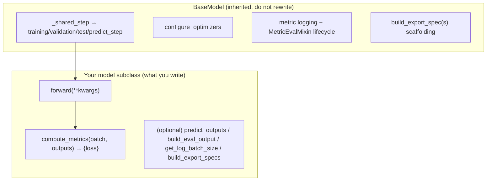

# 模型架構（Model Architecture）

> **本文涵蓋內容：** 深入介紹 `BaseModel` 合約、一個具體的模型
> （CenterPoint）如何由 backbone／neck／head 等元件組裝而成，以及如何新增自己的模型。
> 各個子元件另有專屬文件：[backbone.md](backbone.md)、[neck.md](neck.md)、
> [head.md](head.md)。
>
> 先備知識：[../code_walkthrough/important_classes.md](../code_walkthrough/important_classes.md)
> （`BaseModel` 參考卡）。

---

## 1. 在此框架中，「模型」是什麼

一個模型是 **`BaseModel`** 的子類別，本身*就是*一個
`lightning.LightningModule`。它是一個**輕薄的包裝器（wrapper）**，負責：

1. 持有已經建構好的子模組（由 Hydra 建構出的 `nn.Module`），
2. 定義 `forward()`（網路本身）與 `compute_metrics()`（loss），
3. 選擇性地覆寫少數幾個 hook（`predict_outputs`、`build_eval_output`、
   `get_log_batch_size`、`build_export_specs`）。

其他所有東西 — train/val/test/predict 各個 step、optimizer 設定、metric 紀錄，
以及 export 的骨架程式碼 — 都是繼承而來的。設計目標是：**模型的作者只需要撰寫
網路本身與 loss，僅此而已。**



---

## 2. `BaseModel` 合約（`models/base.py:42`）

```python
class BaseModel(MetricEvalMixin, L.LightningModule, ABC):
    def __init__(self, optimizer=None, scheduler=None,
                 optimizer_group_overrides=None, scheduler_config=None, metrics=None):
        super().__init__(metrics=metrics)                       # MetricEvalMixin → LightningModule
        self.forward_signature = inspect.signature(self.forward)   # :71  captured ONCE
        self.optimizer_partial = optimizer                      # a functools.partial (from _partial_)
        self.scheduler_partial = scheduler
        self._data_preprocessing = DataPreprocessing()          # empty until set_data_preprocessing()

    @abstractmethod
    def forward(self, **kwargs) -> Any: ...                     # any signature
    @abstractmethod
    def compute_metrics(self, batch, outputs) -> dict: ...      # MUST return "loss"
```

### 統一的 step（`_shared_step`，`base.py:239`）

```python
def _shared_step(self, batch, step_prefix, **kwargs):
    forward_inputs = {k: batch[k] for k in self.forward_signature.parameters if k in batch}   # :253
    outputs = self(**forward_inputs)                            # :258  forward()
    metrics = self.compute_metrics(batch, outputs)             # :259  loss (+ extra scalars)
    if "loss" not in metrics:
        raise ValueError("compute_metrics() must return a dict containing a 'loss' key.")     # :260
    batch_size = self.get_log_batch_size(batch)
    self.log_dict({f"{step_prefix}/{k}": v for k, v in metrics.items()}, batch_size=batch_size, **kwargs)
    return metrics, outputs
```

三個值得記住的結果：

1. **依簽名（signature）過濾。** 只有名稱與 `forward` 參數相同的 batch key 才會
   被傳入。`forward(self, voxels, num_points, voxel_coords)` 只會拿到這三個；
   `gt_boxes` 永遠不會進入 `forward`，但仍然會留在 `batch` 中供 `compute_metrics`
   使用。**你的 `forward` 參數名稱就是一份公開 API — 它們必須與前處理後的 batch
   key 一致。**
2. **`"loss"` 是必要的。** `compute_metrics` 必須回傳它，否則該 step 會丟出例外。
3. **所有的 step 方法都是 `@final`。** `training_step`/`validation_step`/
   `test_step`/`predict_step`（`base.py:270`–`356`）無法被覆寫 — 請改用 hook 來
   客製化。
   - `training_step` 回傳 `metrics["loss"]`（由 Lightning 進行反向傳播）。
   - `validation_step`/`test_step` 回傳 `{**metrics, "model_outputs": outputs}`，
     好讓 metric suite 能在 epoch 結束時累積原始的輸出（見
     [../evaluation/evaluation_pipeline.md](../evaluation/evaluation_pipeline.md)）。

### 你可以覆寫的 hook

| Hook | 預設 | 何時覆寫… | 行號 |
| ---- | ------- | -------------- | ---- |
| `predict_outputs(batch, outputs)` | 原封不動回傳 outputs | 當 prediction 與 training 的輸出不同時（解碼框、argmax） | `:109` |
| `build_eval_output(batch, outputs)` | `{}`（透過 mixin） | 當這個模型有 metrics 時 — 把 outputs 對映成 metric suite 讀取的扁平 dict | `metrics/eval_mixin.py` |
| `get_log_batch_size(batch)` | Lightning 從 forward 輸入推斷 | 輸入長度不一（點雲）時 — 回傳真正的 sample 數量 | `:219` |
| `build_export_specs(batch)` | 一個 `end_to_end` 的 ONNX 模組 | 當你需要拆分的 export 模組時 | `:380` |
| `on_after_batch_transfer` | 執行 `DataPreprocessing` | 很少需要 — 它本來就會執行你設定好的 pipeline | `:94` |

---

## 3. 一個具體的模型：`CenterPointDetectionModel`（`models/detection3d/centerpoint.py:73`）

這是一個典型、脈絡清晰易追蹤的偵測器（detector）。可以把它當成「一個模型實際上
需要多少程式碼」的範本 — 答案是*非常少*。

```python
class CenterPointDetectionModel(BaseModel):
    def __init__(self, pts_voxel_encoder, pts_middle_encoder, pts_backbone, pts_neck, bbox_head,
                 optimizer=None, scheduler=None, metrics=None):
        super().__init__(optimizer=optimizer, scheduler=scheduler, metrics=metrics)
        self.pts_voxel_encoder = pts_voxel_encoder     # PillarFeatureNet   (an ENCODER)
        self.pts_middle_encoder = pts_middle_encoder   # PointPillarsScatter (voxel → dense BEV)
        self.pts_backbone = pts_backbone               # SECONDBackbone     (see backbone.md)
        self.pts_neck = pts_neck                       # SECONDFPN          (see neck.md)
        self.bbox_head = bbox_head                     # CenterHead         (see head.md)

    def forward(self, voxels, num_points, voxel_coords):           # :114
        batch_size = infer_batch_size_from_voxel_coords(voxel_coords)
        point_features = self.pts_voxel_encoder(voxels, num_points, voxel_coords)
        bev_features   = self.pts_middle_encoder(point_features, voxel_coords, batch_size=batch_size)
        bev_features   = self.pts_backbone(bev_features)           # → list of multi-scale maps
        bev_features   = self.pts_neck(bev_features)               # → one fused BEV tensor
        return self.bbox_head(bev_features)                        # → {heatmap, reg, height, dim, rot[, vel]}

    def compute_metrics(self, batch, outputs):                     # :137
        return self.bbox_head.loss(outputs, batch["gt_boxes"], batch["gt_labels"])   # {"loss", "loss_heatmap", "loss_bbox"}

    def predict_outputs(self, batch, outputs):                     # :147
        return self.bbox_head.predict(outputs)                     # decoded boxes/scores/labels

    def build_eval_output(self, batch, outputs):                   # :110  feeds the metric suite
        return detection_eval_output(self.bbox_head.predict(outputs), batch)

    def get_log_batch_size(self, batch):                           # :154
        return len(batch["gt_boxes"])                              # sample count, not voxel count
```

建構子接收的是**已經建構完成**的 `nn.Module` — Hydra 在呼叫這個建構子之前，已經
依照各自的 `_target_` 把它們建構好了（見
[../code_walkthrough/config_flow.md](../code_walkthrough/config_flow.md)）。這個
模型只是把它們接起來，並把 loss／decode 委派給 **head**。注意這裡不斷出現的模式：
**loss 與 decode 都由 head 擁有（own）**；模型包裝器只是呼叫 `bbox_head.loss(...)`
與 `bbox_head.predict(...)`。

### 分階段的架構（encoder → middle → backbone → neck → head）

```text
voxels, num_points, voxel_coords
   │  PillarFeatureNet (pts_voxel_encoder)          per-pillar feature vectors
   ▼
   │  PointPillarsScatter (pts_middle_encoder)      scatter pillars → dense BEV grid (C,H,W)
   ▼
   │  SECONDBackbone (pts_backbone)                 staged 2D convs → multi-scale BEV maps [s1,s2,s3]
   ▼
   │  SECONDFPN (pts_neck)                          upsample + concat → one fused BEV tensor
   ▼
   │  CenterHead (bbox_head)                        dense heatmap + regression maps
   ▼
   {heatmap, reg, height, dim, rot, vel}
```

本 repo 特有的術語說明：**voxel encoder** 與 **scatter** 屬於 *encoder*
（`models/detection3d/encoders/`），2D CNN 是 *backbone*
（`models/detection3d/backbones/`），多尺度融合是 *neck*
（`models/detection3d/necks/`），而密集預測器（dense predictor）則是 *head*
（`models/detection3d/heads/`）。不同的偵測器會以不同方式重用這些建構區塊。

---

## 4. 模型清單

每個模型都是 `BaseModel` 的子類別（PTv3 的各種變體則透過中介的
`PTv3BaseModel`）。

| 任務 | 模型 (`autoware_ml/models/...`) |
| ---- | --------------------------------- |
| **detection3d** | `CenterPointDetectionModel`、`BEVFusionDetectionModel`（lidar+camera）、`TransFusionDetectionModel`、`StreamPETRDetectionModel`（camera／temporal）、`PTv3DetectionModel` |
| **segmentation3d** | `FRNet`、`PTv3SegmentationModel` |
| **multi** | `PTv3SegDetModel`（seg 與 detection 聯合） |
| **calibration_status** | `CalibrationStatusClassifier` |

架構上最完整的是 **BEVFusion**（雙分支 lidar+camera BEV，在共用的
backbone/neck/head 之前有一個 fusion layer）；最適合拿來學習的則是
**CenterPoint**，架構最乾淨。`PTv3` 是大多數文件／範例中使用的旗艦模型。

### 各個建構區塊的位置

| 層級 | 位置 | 範例 |
| ---- | -------- | -------- |
| **共用、跨 task** | `models/common/` | `backbones/`（`ResNet18/50`、`VoVNet…`）、`necks/`（`CPFPN`、`GeneralizedLSSFPN`、`GlobalAveragePooling`）、`heads/`（`LinearClsHead`）、`layers/`（`ConvModule`）、`grid_mask.py` |
| **Task 專屬** | `models/detection3d/` | `backbones/`（`SECONDBackbone`）、`necks/`（`SECONDFPN`）、`encoders/`（`PillarFeatureNet`、`PointPillarsScatter`、`SparseEncoder`）、`heads/`（`CenterHead`、`TransFusionHead`、`StreamPETRHead`）、`view_transforms/`、`fusion.py`、`task_modules/`（assigner、bbox coder） |

---

## 5. 新增一個模型（最精簡的作法）

根據 `docs/contributing/adding-models.md`，最精簡的合約只需要兩個方法：

```python
# autoware_ml/models/my_task/my_model.py
from autoware_ml.models.base import BaseModel

class MyModel(BaseModel):
    def __init__(self, encoder, decoder, num_classes, **kwargs):   # kwargs → optimizer/scheduler/metrics
        super().__init__(**kwargs)
        self.encoder, self.decoder = encoder, decoder
        self.loss_fn = nn.CrossEntropyLoss()

    def forward(self, input_tensor):                # param names MUST match batch keys
        return self.decoder(self.encoder(input_tensor))

    def compute_metrics(self, batch, outputs):
        logits = outputs[0] if isinstance(outputs, (list, tuple)) else outputs
        loss = self.loss_fn(logits, batch["gt_labels"])
        return {"loss": loss, "accuracy": (logits.argmax(1) == batch["gt_labels"]).float().mean()}
```

接著：
1. **Config**（`configs/tasks/my_task/my_model/base.yaml`）：`model._target_`
   指向你的類別，`encoder`/`decoder` 各自有 `_target_` 子模組、optimizer／
   scheduler 使用 `_partial_`，如果需要的話還有 `data_preprocessing` 區塊。
2. 為你的資料建立 **DataModule**（見
   [../dataset/dataset_pipeline.md](../dataset/dataset_pipeline.md)）。
3. 訓練：`autoware-ml train --config-name my_task/my_model/my_variant_my_dataset`。

leaf config 的命名慣例：`<task>/<model>/<variant>_<dataset>`，例如
`detection3d/centerpoint/voxel020_second_secfpn_51m_nuscenes`。

**當預設路徑不夠用時**，請覆寫 hook（不要另外建立獨立的 `LightningModule`）：

```python
def forward(self, image, lidar):                    # multiple inputs → multiple batch keys
    return self.head(torch.cat([self.img_enc(image), self.lidar_enc(lidar)], dim=1))

def predict_outputs(self, batch, outputs):          # decode at inference time
    return decode(outputs)
```

---

## Common debugging cases

| 症狀 | 原因 | 修正 |
| ------- | ----- | --- |
| `forward` 的某個參數出現 `KeyError` | 該 batch key 沒有被產生／collate | 確認有 transform／preprocessing 產生它，**並且**它在 `collation_map` 中 |
| `compute_metrics() must return a dict containing a 'loss' key` | 忘了回傳 `"loss"` | 補上它 |
| 多餘的 batch key 被 `forward` 忽略 | 依簽名過濾（設計如此） | 改到 `compute_metrics` 中讀取這些 key |
| Metric 從未被記錄，只有 loss | 模型沒有覆寫 `build_eval_output`，或是 `metrics` 是空的 | 實作 `build_eval_output`；在 config 中設定 `model.metrics` |
| `configure_optimizers`：「Optimizer must be provided」 | config 中沒有 `optimizer` | 加入帶有 `_partial_: true` 的 `optimizer` |
| 記錄到的 batch size 不對 | 長度不一的輸入讓 Lightning 的推斷失準 | 覆寫 `get_log_batch_size`（CenterPoint 回傳 `len(gt_boxes)`） |
| 無法覆寫 `training_step` | 它是 `@final` | 改用 hook（`predict_outputs`、`on_after_batch_transfer` 等） |

---

## Common modification scenarios

| 我想要… | 這樣做 |
| ---------- | ------- |
| 新增一個模型 | 繼承 `BaseModel`（`forward`＋`compute_metrics`）＋ config；見 §5 |
| 替換 backbone/neck/head | 改變 config 中該子模組的 `_target_`（如果介面相符，不需要改 Python 程式碼） |
| 新增一個輔助（auxiliary）loss | 從 `compute_metrics` 多回傳一個 key（例如 `loss_aux`）；把它加進 `"loss"` 中 |
| 改變 prediction 的樣子 | 覆寫 `predict_outputs` |
| 為一個模型新增 metrics | 覆寫 `build_eval_output`；在 config 中把 suite 加進 `model.metrics` |
| 多模態（Multi-modal）輸入 | 讓 `forward` 有多個參數；確保 batch key 一致 |

---

**Next:** [backbone.md](backbone.md) · [neck.md](neck.md) · [head.md](head.md)。
